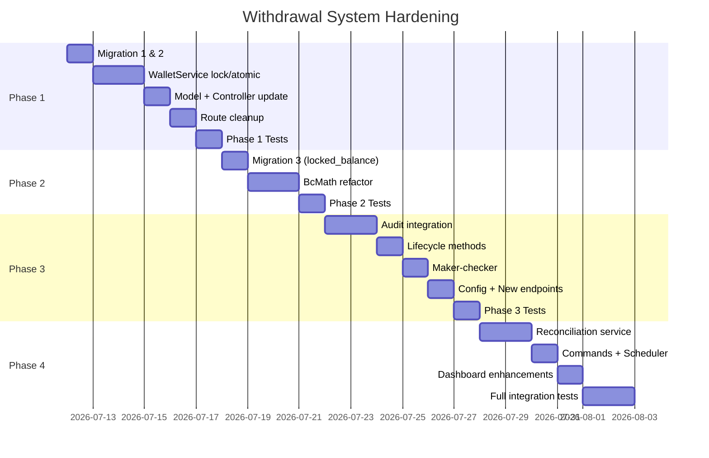

# แผนปรับปรุงระบบถอนเงินและอนุมัติการถอน — ฉบับสมบูรณ์ (v2)

> [!NOTE]
> **v2 (2026-07-11)** — ปรับปรุงจากการ audit โค้ดเชิงลึกรอบสอง: เพิ่มข้อค้นพบ 4 ประเด็น (13–16), แก้ความคลาดเคลื่อนของ v1, และเพิ่ม **Runbook แบบทีละขั้นตอน** (ดูท้ายไฟล์) พร้อม commit boundaries / verification gates / rollback ทุก step

## สรุปปัญหา

ระบบถอนเงินปัจจุบันมีความเสี่ยงระดับสูง ไม่ควรนำไปใช้กับเงินจริงโดยไม่ทำ Hardening ก่อน จากการวิเคราะห์โค้ดทั้ง 4 ไฟล์หลักและไฟล์เกี่ยวข้องพบปัญหาทั้งหมด **16 ประเด็นวิกฤต**

---

## User Review Required

> [!CAUTION]
> **ระบบนี้เกี่ยวข้องกับเงินจริง** — ทุกการเปลี่ยนแปลงต้องผ่านการ review อย่างละเอียดก่อน deploy เนื่องจากข้อผิดพลาดอาจทำให้ยอดเงินไม่ตรงและไม่สามารถกู้คืนได้

> [!IMPORTANT]
> **การเปลี่ยน Schema** — Phase 1 และ 2 ต้องมี migration ใหม่ที่จะเพิ่มคอลัมน์ในตาราง `wallet_transactions` และ `users` รวมถึงสร้างตารางใหม่ `withdrawal_audit_logs` กรุณา review migration ก่อนรัน

> [!WARNING]
> **Backward Compatibility** — การเปลี่ยน status enum จาก 4 สถานะเป็น 8 สถานะจะกระทบ frontend ทุกหน้าที่อ่าน status ของ withdrawal รวมถึง admin panel ที่มีอยู่

---

## Decisions — Approved Defaults (2026-07-11)

> [!IMPORTANT]
> Open Questions ทั้ง 6 ได้รับการอนุมัติค่า default แล้ว ใช้ค่าเหล่านี้เป็นฐานในการ implement ทุก Phase

| # | หัวข้อ | ค่าที่อนุมัติ | ที่เก็บค่า |
|---|--------|-------------|-----------|
| 1 | Maker-Checker threshold | **≥ 10,000 บาท** ต้อง Admin คนที่ 2 อนุมัติ (ห้ามคนเดียวกับที่ review) | `config('wallet.withdraw.maker_checker_threshold')` |
| 2 | Pending พร้อมกัน | **1 รายการ** (มี pending/under_review/approved/processing อยู่ → บล็อกคำขอใหม่) | `config('wallet.withdraw.max_pending_requests')` |
| 3 | Daily / Monthly limit | **100,000 / วัน, 500,000 / เดือน** | `config('wallet.withdraw.daily_limit'/'monthly_limit')` |
| 4 | Encryption ข้อมูลบัญชี | **Laravel `encrypt()` (APP_KEY)** — envelope/KMS ไว้เฟสหลังถ้าต้อง PCI | เก็บใน `destination_snapshot` |
| 5 | สิทธิ์ Admin | **approve = SUPER_ADMIN + ADMIN, reject = เท่ากัน, MODERATOR = ดูอย่างเดียว** บังคับผ่าน `WithdrawalPolicy` เดียว | `WithdrawalPolicy` |
| 6 | Frontend impact | **7 ไฟล์** (ดูตารางด้านล่าง) — ต้องแก้พร้อม backend | — |

### Frontend ที่กระทบ (ข้อ 6)

| ไฟล์ | สิ่งที่ต้องแก้ |
|------|--------------|
| `ui/components/Common/UnifiedTransactionCard.vue` (L42) | ขยาย TypeScript union `status` เป็น 9 สถานะ + label/สี |
| `ui/components/wallet/TransactionCard.vue` | status badge รองรับสถานะใหม่ |
| `ui/pages/nuxnan-admin/wallet/pending.vue` | **repoint API path** + ปุ่ม lifecycle ใหม่ (process/mark-paid/mark-failed) |
| `ui/pages/nuxnan-admin/wallet/index.vue` | admin dashboard stats ใหม่ |
| `ui/pages/Admin/Wallet.vue` | admin dashboard stats ใหม่ |
| `ui/pages/Earn/Wallet.vue` | หน้าถอนเงินผู้ใช้ + ปุ่ม cancel + แสดง locked balance |
| `ui/composables/useWallet.ts` + `ui/composables/useAdminWallet.ts` | sync config + endpoint ใหม่ |

> [!WARNING]
> **Route coupling ที่ยืนยันแล้ว**: `ui/pages/nuxnan-admin/wallet/pending.vue` เรียก `/api/admin/wallet/withdrawals/pending` (route ชุด [admin.php](file:///c:/wamp64/www/nuxnan/api/nuxnanravel/routes/admin/admin.php#L520)) **ไม่ใช่** ชุด `nuxnan-admin/wallet` ใน points-wallet.php → การลบ route ซ้ำต้อง **repoint frontend ในคอมมิตเดียวกัน** ไม่งั้นหน้า admin พัง

---

## ผลวิเคราะห์โค้ดฉบับเต็ม (12 ประเด็น)

### ⚠️ ปัญหาที่ค้นพบเพิ่มเติมจากการวิเคราะห์เดิม

**8. Route ซ้ำ 3 ชุด** — Withdrawal approve/reject ลงทะเบียนไว้ใน 3 ที่:
- [points-wallet.php](file:///c:/wamp64/www/nuxnan/api/nuxnanravel/routes/earn/points-wallet.php#L64-L67) → `WalletController` ผ่าน `role:admin` middleware
- [points-wallet.php](file:///c:/wamp64/www/nuxnan/api/nuxnanravel/routes/earn/points-wallet.php#L128-L140) → `AdminWalletController` ผ่าน `plearnd_admin` middleware
- [admin.php](file:///c:/wamp64/www/nuxnan/api/nuxnanravel/routes/admin/admin.php#L518-L526) → `AdminWalletController` (ไม่มี middleware กำกับเพิ่ม)

**9. อนุมัติไม่ตรวจ `lockForUpdate()`** — [approveWithdrawal()](file:///c:/wamp64/www/nuxnan/api/nuxnanravel/app/Services/WalletService.php#L389-L405) ไม่อยู่ใน `DB::transaction()` เลย เพียงเปลี่ยน status เป็น `completed`

**10. ปฏิเสธไม่ lock user** — [rejectWithdrawal()](file:///c:/wamp64/www/nuxnan/api/nuxnanravel/app/Services/WalletService.php#L410-L440) ใช้ `DB::transaction()` แต่ไม่ lock user row ก่อนคืนเงิน ทำให้ race condition กับ deposit/transfer ได้

**11. ค่า `users.wallet` ใช้ `decimal:2` cast** — ดีกว่า float บน model แต่ [WalletService](file:///c:/wamp64/www/nuxnan/api/nuxnanravel/app/Services/WalletService.php#L57) รับ parameter เป็น `float $amount` ซึ่งอาจ lose precision ก่อนถึง model

**12. ไม่มี version/optimistic lock บน withdrawal** — ไม่มี `version` column สำหรับ optimistic concurrency control

### ⚠️ ข้อค้นพบเพิ่มเติมรอบ v2 (audit เชิงลึก)

**13. Auth ไม่สอดคล้องกันภายใน `AdminWalletController` เอง** (บั๊กสิทธิ์ที่ยืนยันแล้ว)
- [`approveWithdrawal()`](file:///c:/wamp64/www/nuxnan/api/nuxnanravel/app/Http/Controllers/Api/AdminWalletController.php#L204) ตรวจ `$user->isSuperAdmin()` **เท่านั้น**
- [`rejectWithdrawal()`](file:///c:/wamp64/www/nuxnan/api/nuxnanravel/app/Http/Controllers/Api/AdminWalletController.php#L293) ใช้ `$this->isAdminUser($user)` ซึ่งอนุญาต `ADMIN`, `MODERATOR`, `PlearndAdmin`
- ผล: **MODERATOR/ADMIN สามารถ "ปฏิเสธ" (คืนเงิน) ได้ แต่ "อนุมัติ" ไม่ได้** — สิทธิ์ไม่สมมาตร และการคืนเงินเป็น action ที่กระทบยอดจริง กลับตรวจสิทธิ์หลวมกว่าการอนุมัติ

**14. Response payload hardcode สถานะเก่า** — [approveWithdrawal บรรทัด 234](file:///c:/wamp64/www/nuxnan/api/nuxnanravel/app/Http/Controllers/Api/AdminWalletController.php#L234) ส่ง `'status' => 'completed'` และ [rejectWithdrawal บรรทัด 327](file:///c:/wamp64/www/nuxnan/api/nuxnanravel/app/Http/Controllers/Api/AdminWalletController.php#L327) ส่ง `'status' => 'cancelled'` แบบ hardcode ใน response (ไม่ได้อ่านจาก DB จริง) → หลังเปลี่ยน state machine ต้องอ่านค่าจริงจาก transaction ที่ refresh แล้ว

**15. `reject` เขียนทับเป็น `cancelled` — ปะปนความหมาย** — [WalletService::rejectWithdrawal บรรทัด 428](file:///c:/wamp64/www/nuxnan/api/nuxnanravel/app/Services/WalletService.php#L428) set `status => 'cancelled'` เหมือนกับกรณีผู้ใช้ยกเลิกเอง ทำให้:
- ข้อมูลเก่าแยกไม่ออกระหว่าง admin-reject กับ user-cancel (data migration ทำได้แค่ mark ทั้งหมดเป็นสถานะกลาง + หมายเหตุ ไม่สามารถ backfill แม่นยำ)
- [`AdminWalletController::stats()`](file:///c:/wamp64/www/nuxnan/api/nuxnanravel/app/Http/Controllers/Api/AdminWalletController.php#L52) ใช้ `where('status','!=','cancelled')` นับ total และ `where('status','completed')` นับ completed → **ทุก query สถิติต้องแก้พร้อมกัน** เมื่อ enum เปลี่ยนเป็น 9 สถานะ ไม่งั้นตัวเลข dashboard เพี้ยน

**16. Frontend mirror config โดยตรง** — [config/wallet.php บรรทัด 10-11](file:///c:/wamp64/www/nuxnan/api/nuxnanravel/config/wallet.php#L10-L11) ระบุว่า `ui/composables/useWallet.ts` ทำสำเนาค่า fee ไว้ฝั่ง frontend → การเพิ่ม config (maker_checker_threshold, daily_limit ฯลฯ) และการเปลี่ยนสูตรค่าธรรมเนียม **ต้อง sync frontend** และควรพิจารณาทำ endpoint `GET /wallet/config` ให้ frontend ดึงค่าเดียวจาก backend แทนการ hardcode ซ้ำ

### แก้ความคลาดเคลื่อนของ v1

- **v1 เข้าใจผิด**: ไม่มี business logic ซ้ำใน controller — ทั้ง `WalletController` และ `AdminWalletController` ต่าง delegate เข้า `WalletService` เดียวกัน (การ hardcode ที่บรรทัด 234/327 เป็นแค่ค่าใน response payload) → **การรวมศูนย์ทำที่ระดับ route + auth เป็นหลัก** ส่วน service ยังเป็นจุดเดียวของ business logic ที่ต้อง hardening
- **decimal precision ไม่สม่ำเสมอ**: ตาราง `wallet_transactions` ใช้ `decimal(10,2)` (เพดาน ~99.9M) แต่ v1 เสนอ `locked_balance decimal(15,2)` — ต้องเลือกให้สอดคล้อง แนะนำใช้ `decimal(15,2)` **ทั้งชุด** (users.wallet, locked_balance, amount, balance_*, fee, net_amount) เพื่อรองรับการเติบโต และหลีกเลี่ยง overflow เงียบ — เพิ่มเป็น migration แยกใน Phase 2

---

## โครงสร้างไฟล์ที่เกี่ยวข้อง

| ไฟล์ | บทบาท | ปัญหาที่พบ |
|------|-------|------------|
| [WalletService.php](file:///c:/wamp64/www/nuxnan/api/nuxnanravel/app/Services/WalletService.php) | Business logic หลัก | Race condition, float, no audit, no lock |
| [WalletController.php](file:///c:/wamp64/www/nuxnan/api/nuxnanravel/app/Http/Controllers/Api/WalletController.php) | User-facing API | Duplicate admin routes, no pending policy |
| [AdminWalletController.php](file:///c:/wamp64/www/nuxnan/api/nuxnanravel/app/Http/Controllers/Api/AdminWalletController.php) | Admin API | Inconsistent auth check |
| [WalletTransaction.php](file:///c:/wamp64/www/nuxnan/api/nuxnanravel/app/Models/WalletTransaction.php) | Model | Missing withdrawal-specific fields |
| [wallet_transactions migration](file:///c:/wamp64/www/nuxnan/api/nuxnanravel/database/migrations/2026_01_13_200001_create_wallet_transactions_table.php) | Schema | Status enum ไม่ครอบคลุม lifecycle |
| [points-wallet.php](file:///c:/wamp64/www/nuxnan/api/nuxnanravel/routes/earn/points-wallet.php) | Routes | 3 ชุดซ้ำ, auth ไม่ตรงกัน |
| [admin.php](file:///c:/wamp64/www/nuxnan/api/nuxnanravel/routes/admin/admin.php#L518-L526) | Admin routes | ซ้ำกับ points-wallet.php |
| [AuditLogService.php](file:///c:/wamp64/www/nuxnan/api/nuxnanravel/app/Services/AuditLogService.php) | Audit infrastructure | มีอยู่แล้ว ใช้ได้ทันที |
| [Auditable.php](file:///c:/wamp64/www/nuxnan/api/nuxnanravel/app/Traits/Auditable.php) | Auto-audit trait | มีอยู่แล้ว เพิ่ม trait ใน model ได้ |
| [config/wallet.php](file:///c:/wamp64/www/nuxnan/api/nuxnanravel/config/wallet.php) | Config | มีเฉพาะ fee settings |

---

## Proposed Changes

## Phase 1: หยุดความเสี่ยงเร่งด่วน (Critical Safety)

**เป้าหมาย:** ปิด race condition, ทำ atomic state transition, ป้องกัน double-approve/reject, เพิ่ม reviewer tracking, เพิ่ม compensating ledger

---

### 1.1 Database Migration — เพิ่ม Withdrawal Fields

#### [NEW] [2026_07_12_000001_add_withdrawal_fields_to_wallet_transactions.php](file:///c:/wamp64/www/nuxnan/api/nuxnanravel/database/migrations/2026_07_12_000001_add_withdrawal_fields_to_wallet_transactions.php)

เพิ่มคอลัมน์ในตาราง `wallet_transactions`:

```php
Schema::table('wallet_transactions', function (Blueprint $table) {
    // Withdrawal lifecycle fields
    $table->unsignedBigInteger('reviewed_by')->nullable()->after('status');
    $table->timestamp('reviewed_at')->nullable()->after('reviewed_by');
    $table->text('rejection_reason')->nullable()->after('reviewed_at');
    $table->text('admin_note')->nullable()->after('rejection_reason');
    $table->string('payment_reference', 100)->nullable()->after('admin_note');
    $table->timestamp('processed_at')->nullable()->after('payment_reference');
    $table->timestamp('failed_at')->nullable()->after('processed_at');
    $table->string('idempotency_key', 64)->nullable()->after('failed_at');
    $table->unsignedInteger('version')->default(1)->after('idempotency_key');

    // Fee tracking (ย้ายจาก metadata JSON ออกมาเป็นคอลัมน์ถาวร)
    $table->decimal('fee', 10, 2)->default(0)->after('amount');
    $table->decimal('net_amount', 10, 2)->nullable()->after('fee');

    // Destination snapshot (เข้ารหัส)
    $table->string('destination_type', 20)->nullable()->after('net_amount');
    $table->text('destination_snapshot')->nullable()->after('destination_type');

    // Indexes
    $table->index('reviewed_by');
    $table->unique('idempotency_key');
    $table->index(['transaction_type', 'status']);
    $table->index(['user_id', 'transaction_type', 'status']);

    // Foreign key
    $table->foreign('reviewed_by')->references('id')->on('users')->nullOnDelete();
});
```

**เหตุผล:**
- `reviewed_by`, `reviewed_at` — ติดตามว่าใครอนุมัติ/ปฏิเสธเมื่อไร
- `rejection_reason`, `admin_note` — บันทึกเหตุผลถาวร (ไม่ใช่ใน JSON)
- `payment_reference` — เลขอ้างอิงการโอนเงินจริง
- `fee`, `net_amount`, `destination_type`, `destination_snapshot` — ย้ายออกจาก metadata JSON เป็นคอลัมน์ถาวรเพื่อ query ได้
- `idempotency_key` — unique index ป้องกันคำขอซ้ำ
- `version` — optimistic concurrency control

---

### 1.2 เปลี่ยน Status Enum

#### [NEW] [2026_07_12_000002_update_wallet_transaction_status_enum.php](file:///c:/wamp64/www/nuxnan/api/nuxnanravel/database/migrations/2026_07_12_000002_update_wallet_transaction_status_enum.php)

```php
// เปลี่ยน enum จาก 4 สถานะเป็น 8 สถานะ
DB::statement("ALTER TABLE wallet_transactions MODIFY COLUMN status
    ENUM('pending','under_review','approved','processing','completed','paid','rejected','failed','cancelled')
    DEFAULT 'completed'");
```

**State Machine สำหรับ Withdrawal:**

```text
pending ──────→ under_review ──────→ approved ──→ processing ──→ paid
   │                 │                  │              │
   └──→ cancelled    └──→ rejected      └──→ failed    └──→ failed
```

**กฎการเปลี่ยนสถานะ:**
| From | To | ผู้กระทำ | เงื่อนไข |
|------|----|---------|---------|
| `pending` | `under_review` | Admin เปิดดู | อัตโนมัติ |
| `pending` | `cancelled` | User ยกเลิก | ต้องคืนเงินเข้า available |
| `under_review` | `approved` | Admin อนุมัติ | ต้องใน DB::transaction + lock |
| `under_review` | `rejected` | Admin ปฏิเสธ | ต้องคืนเงิน + สร้าง refund ledger |
| `approved` | `processing` | ระบบ/Admin | เริ่มโอนเงินจริง |
| `processing` | `paid` | ระบบ/Admin | โอนสำเร็จ ใส่ payment_reference |
| `approved`/`processing` | `failed` | ระบบ | โอนไม่สำเร็จ ต้องคืนเงิน |

---

### 1.3 แก้ไข WalletService — เพิ่ม Lock และ Atomic Operations

#### [MODIFY] [WalletService.php](file:///c:/wamp64/www/nuxnan/api/nuxnanravel/app/Services/WalletService.php)

**1.3.1 แก้ `withdraw()` — เพิ่ม `lockForUpdate()` + idempotency**

```php
public function withdraw(
    User $user,
    string $amount,          // เปลี่ยนจาก float เป็น string
    string $method,
    array $bankAccount,
    ?string $description = null,
    ?string $idempotencyKey = null
): ?WalletTransaction {
    return DB::transaction(function () use ($user, $amount, $method, $bankAccount, $description, $idempotencyKey) {
        // ===== CRITICAL: Lock user row ก่อนอ่านยอด =====
        $user = User::lockForUpdate()->find($user->id);

        // ===== Idempotency check =====
        if ($idempotencyKey) {
            $existing = WalletTransaction::where('idempotency_key', $idempotencyKey)->first();
            if ($existing) {
                return $existing; // คืนรายการเดิม ไม่สร้างใหม่
            }
        }

        // ===== Pending withdrawal policy =====
        $pendingCount = WalletTransaction::where('user_id', $user->id)
            ->where('transaction_type', 'withdraw')
            ->whereIn('status', ['pending', 'under_review', 'approved', 'processing'])
            ->count();
        if ($pendingCount > 0) {
            throw new \DomainException('คุณมีคำขอถอนเงินที่ยังดำเนินการอยู่ กรุณารอให้เสร็จก่อน');
        }

        $balanceBefore = $user->wallet;

        // ===== ใช้ bccomp แทน < เพื่อ decimal safety =====
        if (bccomp((string) $balanceBefore, $amount, 2) < 0) {
            return null;
        }

        // ===== คำนวณ fee ด้วย bcmath =====
        $fee = $method === 'internal_deduction'
            ? '0.00'
            : bcmax(
                bcmul($amount, (string) config('wallet.withdraw.fee_rate'), 4),
                (string) config('wallet.withdraw.fee_min')
              );
        $fee = bcround($fee, 2);
        $netAmount = bcsub($amount, $fee, 2);
        $balanceAfter = bcsub((string) $balanceBefore, $amount, 2);

        $destinationType = ($bankAccount['bank_name'] ?? null) === 'promptpay'
            ? 'promptpay' : 'bank_transfer';

        // ===== ตัดยอดจริง =====
        $user->update(['wallet' => $balanceAfter]);

        // ===== Mask & encrypt ข้อมูลบัญชี =====
        $maskedAccount = $this->maskBankAccount($bankAccount);
        $encryptedSnapshot = encrypt(json_encode($bankAccount));

        $transaction = WalletTransaction::create([
            'user_id'              => $user->id,
            'transaction_type'     => 'withdraw',
            'amount'               => $amount,
            'fee'                  => $fee,
            'net_amount'           => $netAmount,
            'balance_before'       => $balanceBefore,
            'balance_after'        => $balanceAfter,
            'currency'             => 'THB',
            'description'          => $description ?? "ถอนเงินผ่าน {$method}",
            'destination_type'     => $destinationType,
            'destination_snapshot'  => $encryptedSnapshot,
            'metadata'             => ['method' => $method, 'masked_account' => $maskedAccount],
            'status'               => 'pending',
            'idempotency_key'      => $idempotencyKey,
            'version'              => 1,
        ]);

        // ===== Audit =====
        app(AuditLogService::class)->logCustom('withdrawal.created', $transaction, [
            'user_id'     => $user->id,
            'amount'      => $amount,
            'fee'         => $fee,
            'net_amount'  => $netAmount,
            'method'      => $method,
            'destination' => $maskedAccount,
        ], 'wallet');

        return $transaction;
    });
}
```

**1.3.2 แก้ `approveWithdrawal()` — Atomic + Reviewer tracking**

```php
public function approveWithdrawal(
    WalletTransaction $transaction,
    User $reviewer,
    ?string $adminNote = null,
    ?string $paymentReference = null
): bool {
    return DB::transaction(function () use ($transaction, $reviewer, $adminNote, $paymentReference) {
        // ===== Lock withdrawal row =====
        $transaction = WalletTransaction::lockForUpdate()->find($transaction->id);

        // ===== ตรวจสถานะเดิม (atomic state check) =====
        if ($transaction->transaction_type !== 'withdraw' ||
            !in_array($transaction->status, ['pending', 'under_review'])) {
            return false;
        }

        // ===== Version check (optimistic lock) =====
        $currentVersion = $transaction->version;

        $updated = WalletTransaction::where('id', $transaction->id)
            ->where('version', $currentVersion)
            ->update([
                'status'            => 'approved',
                'reviewed_by'       => $reviewer->id,
                'reviewed_at'       => now(),
                'admin_note'        => $adminNote,
                'payment_reference' => $paymentReference,
                'version'           => $currentVersion + 1,
            ]);

        if ($updated === 0) {
            throw new \RuntimeException('Concurrent modification detected');
        }

        // ===== Audit =====
        app(AuditLogService::class)->logCustom('withdrawal.approved', $transaction, [
            'reviewer_id'       => $reviewer->id,
            'admin_note'        => $adminNote,
            'payment_reference' => $paymentReference,
            'previous_status'   => $transaction->status,
        ], 'wallet');

        return true;
    });
}
```

**1.3.3 แก้ `rejectWithdrawal()` — Atomic + Refund Ledger**

```php
public function rejectWithdrawal(
    WalletTransaction $transaction,
    string $reason,
    User $reviewer,
    ?string $adminNote = null
): bool {
    if ($transaction->transaction_type !== 'withdraw') {
        return false;
    }

    return DB::transaction(function () use ($transaction, $reason, $reviewer, $adminNote) {
        // ===== Lock ทั้ง withdrawal และ user =====
        $transaction = WalletTransaction::lockForUpdate()->find($transaction->id);

        if (!in_array($transaction->status, ['pending', 'under_review'])) {
            return false;
        }

        $user = User::lockForUpdate()->find($transaction->user_id);

        $currentVersion = $transaction->version;
        $balanceBefore = $user->wallet;
        $refundAmount = $transaction->amount;
        $balanceAfter = bcadd((string) $balanceBefore, (string) $refundAmount, 2);

        // ===== คืนเงิน =====
        $user->update(['wallet' => $balanceAfter]);

        // ===== เปลี่ยนสถานะ withdrawal =====
        $updated = WalletTransaction::where('id', $transaction->id)
            ->where('version', $currentVersion)
            ->update([
                'status'           => 'rejected',
                'reviewed_by'      => $reviewer->id,
                'reviewed_at'      => now(),
                'rejection_reason' => $reason,
                'admin_note'       => $adminNote,
                'version'          => $currentVersion + 1,
            ]);

        if ($updated === 0) {
            throw new \RuntimeException('Concurrent modification detected');
        }

        // ===== สร้าง Compensating Ledger Entry =====
        WalletTransaction::create([
            'user_id'          => $user->id,
            'transaction_type' => 'refund',
            'amount'           => $refundAmount,
            'balance_before'   => $balanceBefore,
            'balance_after'    => $balanceAfter,
            'currency'         => 'THB',
            'description'      => "คืนเงินจากการปฏิเสธคำขอถอน #{$transaction->id}",
            'metadata'         => [
                'original_withdrawal_id' => $transaction->id,
                'rejection_reason'       => $reason,
                'refund_type'            => 'withdrawal_reversal',
            ],
            'status'           => 'completed',
            'reference_number' => "WDR-{$transaction->id}",
        ]);

        // ===== Audit =====
        app(AuditLogService::class)->logCustom('withdrawal.rejected', $transaction, [
            'reviewer_id'   => $reviewer->id,
            'reason'        => $reason,
            'admin_note'    => $adminNote,
            'refund_amount' => $refundAmount,
            'balance_before' => $balanceBefore,
            'balance_after'  => $balanceAfter,
        ], 'wallet');

        return true;
    });
}
```

**1.3.4 เพิ่ม Helper Methods**

```php
private function maskBankAccount(array $bankAccount): array
{
    $number = $bankAccount['account_number'] ?? '';
    $masked = str_repeat('*', max(0, strlen($number) - 4)) . substr($number, -4);
    return [
        'bank_name'      => $bankAccount['bank_name'] ?? '',
        'account_number' => $masked,
        'account_name'   => $bankAccount['account_name'] ?? '',
    ];
}
```

---

### 1.4 รวม Endpoint ซ้ำ ให้ใช้ AdminWalletController เดียว

#### [MODIFY] [points-wallet.php](file:///c:/wamp64/www/nuxnan/api/nuxnanravel/routes/earn/points-wallet.php)

- **ลบ** withdrawal approve/reject ออกจาก `WalletController` routes (L64-67)
- **คง** เฉพาะ `AdminWalletController` routes ใน nuxnan-admin prefix (L128-139)
- **ลบ** duplicate wallet routes จาก [admin.php](file:///c:/wamp64/www/nuxnan/api/nuxnanravel/routes/admin/admin.php#L518-L526)

#### [MODIFY] [WalletController.php](file:///c:/wamp64/www/nuxnan/api/nuxnanravel/app/Http/Controllers/Api/WalletController.php)

- **ลบ** methods `approveWithdrawal()` และ `rejectWithdrawal()` (L502-598)

#### [MODIFY] [AdminWalletController.php](file:///c:/wamp64/www/nuxnan/api/nuxnanravel/app/Http/Controllers/Api/AdminWalletController.php)

- **แก้บั๊กสิทธิ์ (ข้อ 13)**: ทำให้ `approveWithdrawal()` และ `rejectWithdrawal()` ใช้เกณฑ์สิทธิ์ **ชุดเดียวกัน** — ตัดสินใจก่อน (Open Question 5) ว่าจะให้ระดับใดทำได้ แล้วใช้ policy/gate เดียว (`WithdrawalPolicy`) แทนการเช็ค inline ที่ไม่ตรงกัน
- **แก้** `approveWithdrawal()` / `rejectWithdrawal()` ให้ส่ง `$reviewer` (Auth::user()) ไปยัง service
- **เพิ่ม** `admin_note` parameter ใน approve validation
- **แก้ response payload (ข้อ 14)**: เลิก hardcode `'status' => 'completed'/'cancelled'` — `$transaction->refresh()` แล้วส่ง `$transaction->status` จริง
- **แก้ `stats()` (ข้อ 15)**: อัปเดตทุก query ให้รองรับ enum ใหม่
  - `total_withdrawals`: เปลี่ยนจาก `!= 'cancelled'` เป็น `whereNotIn('status', ['rejected','cancelled','failed'])` (ตามนิยามที่ต้องการ)
  - `completed_withdrawals`: `whereIn('status', ['completed','paid'])`
  - เพิ่มตัวนับ `rejected`, `failed`, `under_review`, `processing` แยก
- **ย้าย inline logic ที่เหลือเข้า service**: ให้ controller เป็น thin layer (validate → authorize → เรียก service → format response) เท่านั้น

---

### 1.5 อัปเดต WalletTransaction Model

#### [MODIFY] [WalletTransaction.php](file:///c:/wamp64/www/nuxnan/api/nuxnanravel/app/Models/WalletTransaction.php)

```php
// เพิ่มใน fillable
'reviewed_by', 'reviewed_at', 'rejection_reason', 'admin_note',
'payment_reference', 'processed_at', 'failed_at',
'idempotency_key', 'version', 'fee', 'net_amount',
'destination_type', 'destination_snapshot',

// เพิ่มใน casts
'fee' => 'decimal:2',
'net_amount' => 'decimal:2',
'reviewed_at' => 'datetime',
'processed_at' => 'datetime',
'failed_at' => 'datetime',
'version' => 'integer',

// เพิ่ม Auditable trait
use \App\Traits\Auditable;

// เพิ่ม auditHidden
protected $auditHidden = ['destination_snapshot'];

// เพิ่ม reviewer relationship
public function reviewer(): BelongsTo
{
    return $this->belongsTo(User::class, 'reviewed_by');
}

// อัปเดต status labels
public function getStatusLabelAttribute(): string
{
    return match ($this->status) {
        'pending'      => 'รอดำเนินการ',
        'under_review' => 'กำลังตรวจสอบ',
        'approved'     => 'อนุมัติแล้ว',
        'processing'   => 'กำลังโอนเงิน',
        'completed'    => 'เสร็จสิ้น',
        'paid'         => 'จ่ายเงินแล้ว',
        'rejected'     => 'ถูกปฏิเสธ',
        'failed'       => 'ล้มเหลว',
        'cancelled'    => 'ยกเลิก',
        default        => $this->status,
    };
}

// เพิ่ม state transition guard
public function canTransitionTo(string $newStatus): bool
{
    $allowed = [
        'pending'      => ['under_review', 'cancelled'],
        'under_review' => ['approved', 'rejected'],
        'approved'     => ['processing', 'failed'],
        'processing'   => ['paid', 'failed'],
    ];
    return in_array($newStatus, $allowed[$this->status] ?? []);
}
```

---

## Phase 2: Ledger ที่ถูกต้อง (Financial Integrity)

**เป้าหมาย:** เพิ่ม locked balance, ใช้ bcmath ทั้งระบบ, แยก fee/net_amount เป็นคอลัมน์ถาวร

---

### 2.1 เพิ่ม Locked Balance ในตาราง Users

#### [NEW] [2026_07_12_000003_add_locked_balance_to_users.php](file:///c:/wamp64/www/nuxnan/api/nuxnanravel/database/migrations/2026_07_12_000003_add_locked_balance_to_users.php)

```php
Schema::table('users', function (Blueprint $table) {
    $table->decimal('locked_balance', 15, 2)->default(0)->after('wallet');
});
```

---

### 2.2 ปรับ Withdraw/Approve/Reject ให้ใช้ Available + Locked Balance

#### [MODIFY] [WalletService.php](file:///c:/wamp64/www/nuxnan/api/nuxnanravel/app/Services/WalletService.php)

**ตัดยอดตอนถอน:**
```php
// แทนที่จะตัด wallet ทันที → ย้ายเข้า locked
$availableBalance = bcsub((string) $user->wallet, (string) $user->locked_balance, 2);
if (bccomp($availableBalance, $amount, 2) < 0) {
    return null; // ยอดไม่พอ
}

$user->update([
    'wallet'         => bcsub((string) $user->wallet, $amount, 2),
    'locked_balance' => bcadd((string) $user->locked_balance, $amount, 2),
]);
```

> [!NOTE]
> ด้วยการออกแบบนี้:
> - `wallet` = ยอดรวมทั้งหมด (available + locked)
> - `locked_balance` = ยอดที่ถูกกั้นรอดำเนินการ
> - `available` = `wallet - locked_balance`
>
> ปรับจากแผนเดิมเพราะการแก้ `wallet` ตอนถอนเป็น pattern ที่โค้ดเดิมใช้ทุกฟังก์ชัน — ถ้าเปลี่ยนจะกระทบ deposit, transfer, purchase ทั้งหมด จึงแนะนำ **เพิ่ม** `locked_balance` แทนการเปลี่ยนโครงสร้าง wallet เดิม

**ตอนอนุมัติและจ่ายสำเร็จ (paid):**
```php
$user->update([
    'locked_balance' => bcsub((string) $user->locked_balance, $amount, 2),
]);
```

**ตอนปฏิเสธ (rejected):**
```php
$user->update([
    'wallet'         => bcadd((string) $user->wallet, $amount, 2),
    'locked_balance' => bcsub((string) $user->locked_balance, $amount, 2),
]);
```

---

### 2.3 เปลี่ยนทุก Method Signature ให้ใช้ string แทน float

#### [MODIFY] [WalletService.php](file:///c:/wamp64/www/nuxnan/api/nuxnanravel/app/Services/WalletService.php)

เปลี่ยน method signatures:
```php
// ก่อน
public function deposit(User $user, float $amount, ...)
public function withdraw(User $user, float $amount, ...)
public function transfer(User $fromUser, User $toUser, float $amount, ...)
public function adminAdjust(User $user, float $amount, ...)

// หลัง
public function deposit(User $user, string $amount, ...)
public function withdraw(User $user, string $amount, ...)
public function transfer(User $fromUser, User $toUser, string $amount, ...)
public function adminAdjust(User $user, string $amount, ...)
```

เปลี่ยนการคำนวณทุกจุดจาก `+`, `-`, `*` เป็น `bcadd()`, `bcsub()`, `bcmul()`, `bccomp()`

---

### 2.4 อัปเดต getBalance()

#### [MODIFY] [WalletService.php](file:///c:/wamp64/www/nuxnan/api/nuxnanravel/app/Services/WalletService.php)

```php
public function getBalance(User $user): array
{
    return [
        'cash_balance'    => $user->wallet,
        'locked_balance'  => $user->locked_balance,
        'available_balance' => bcsub((string)$user->wallet, (string)$user->locked_balance, 2),
        'total_balance'   => $user->wallet,
        'currency'        => 'THB',
    ];
}
```

---

### 2.5 เพิ่ม bcmath Helper Functions

#### [NEW] [BcMathHelper.php](file:///c:/wamp64/www/nuxnan/api/nuxnanravel/app/Helpers/BcMathHelper.php)

```php
function bcmax(string $a, string $b): string {
    return bccomp($a, $b, 4) >= 0 ? $a : $b;
}

function bcround(string $number, int $precision = 2): string {
    // PHP bcmath ไม่มี round ต้องเขียนเอง
    $e = bcpow('10', (string) $precision);
    return bcdiv(bcadd(bcmul($number, $e, $precision + 1), '5'), $e, $precision);
}
```

---

## Phase 3: Audit และการควบคุม Admin (Audit & Access Control)

**เป้าหมาย:** บันทึก audit ทุก action, maker-checker สำหรับยอดสูง, mask ข้อมูลบัญชี

---

### 3.1 เพิ่ม Audit ทุก Withdrawal Action

#### [MODIFY] [WalletService.php](file:///c:/wamp64/www/nuxnan/api/nuxnanravel/app/Services/WalletService.php)

เพิ่ม audit log ในทุก method ที่เกี่ยวกับ withdrawal (ดำเนินการใน Phase 1 แล้วบางส่วน):

| Event | Method | Audit Action |
|-------|--------|-------------|
| ผู้ใช้สร้างคำขอ | `withdraw()` | `withdrawal.created` |
| Admin เปิดดู | `viewWithdrawal()` [ใหม่] | `withdrawal.viewed` |
| Admin อนุมัติ | `approveWithdrawal()` | `withdrawal.approved` |
| Admin ปฏิเสธ | `rejectWithdrawal()` | `withdrawal.rejected` |
| เริ่มประมวลผล | `processWithdrawal()` [ใหม่] | `withdrawal.processing` |
| จ่ายสำเร็จ | `markWithdrawalPaid()` [ใหม่] | `withdrawal.paid` |
| จ่ายล้มเหลว | `markWithdrawalFailed()` [ใหม่] | `withdrawal.failed` |
| ผู้ใช้ยกเลิก | `cancelWithdrawal()` [ใหม่] | `withdrawal.cancelled` |
| Admin override | ทุก method | `withdrawal.admin_override` |

**ข้อมูลที่ audit ต้องเก็บทุกครั้ง:**
```php
[
    'actor_id'        => Auth::id(),
    'actor_role'      => $user->roles,
    'subject_user_id' => $transaction->user_id,
    'action'          => $action,
    'entity_type'     => 'WalletTransaction',
    'entity_id'       => $transaction->id,
    'before'          => ['status' => $oldStatus, 'balance' => $oldBalance],
    'after'           => ['status' => $newStatus, 'balance' => $newBalance],
    'ip_address'      => request()->ip(),
    'user_agent'      => request()->userAgent(),
    'reason'          => $reason,
    'request_id'      => request()->header('X-Request-ID'),
]
```

---

### 3.2 เพิ่ม Withdrawal Lifecycle Methods

#### [MODIFY] [WalletService.php](file:///c:/wamp64/www/nuxnan/api/nuxnanravel/app/Services/WalletService.php)

**เพิ่ม 5 methods ใหม่:**

```php
// Admin เปิดดูรายละเอียด (เปลี่ยน pending → under_review)
public function viewWithdrawal(WalletTransaction $transaction, User $viewer): void

// ผู้ใช้ยกเลิกคำขอของตนเอง (pending → cancelled)
public function cancelWithdrawal(WalletTransaction $transaction, User $user): bool

// เริ่มประมวลผลการโอน (approved → processing)
public function processWithdrawal(WalletTransaction $transaction, User $admin): bool

// โอนสำเร็จ (processing → paid)
public function markWithdrawalPaid(WalletTransaction $transaction, string $paymentReference, User $admin): bool

// โอนล้มเหลว (approved/processing → failed, คืนเงิน)
public function markWithdrawalFailed(WalletTransaction $transaction, string $reason, User $admin): bool
```

---

### 3.3 Maker-Checker สำหรับยอดสูง

#### [MODIFY] [AdminWalletController.php](file:///c:/wamp64/www/nuxnan/api/nuxnanravel/app/Http/Controllers/Api/AdminWalletController.php)

```php
public function approveWithdrawal(Request $request, int $transactionId): JsonResponse
{
    $admin = Auth::user();
    $transaction = WalletTransaction::findOrFail($transactionId);

    // ===== Maker-Checker: ยอด >= threshold ต้องมี Admin คนที่สองอนุมัติ =====
    $threshold = config('wallet.withdraw.maker_checker_threshold', 10000);
    if ($transaction->amount >= $threshold) {
        // ตรวจว่า Admin คนเดียวกันที่ reviewed (viewed) ไม่ควร approve
        // ถ้า reviewed_by เป็น admin คนนี้ → ต้องเปลี่ยนคน
        if ($transaction->reviewed_by === $admin->id) {
            return response()->json([
                'success' => false,
                'message' => 'ยอดถอนเกิน '.number_format($threshold).' บาท ต้องให้ Admin คนอื่นอนุมัติ',
            ], 403);
        }
    }

    // ... ดำเนินการอนุมัติ
}
```

---

### 3.4 เพิ่ม Wallet Config

#### [MODIFY] [config/wallet.php](file:///c:/wamp64/www/nuxnan/api/nuxnanravel/config/wallet.php)

```php
return [
    'withdraw' => [
        'min_amount'                => (float) env('WALLET_WITHDRAW_MIN_AMOUNT', 25),
        'fee_rate'                  => (float) env('WALLET_WITHDRAW_FEE_RATE', 0.005),
        'fee_min'                   => (float) env('WALLET_WITHDRAW_FEE_MIN', 5),

        // Phase 3 additions
        'max_pending_requests'      => (int) env('WALLET_WITHDRAW_MAX_PENDING', 1),
        'daily_limit'               => (float) env('WALLET_WITHDRAW_DAILY_LIMIT', 100000),
        'monthly_limit'             => (float) env('WALLET_WITHDRAW_MONTHLY_LIMIT', 500000),
        'maker_checker_threshold'   => (float) env('WALLET_WITHDRAW_MAKER_CHECKER', 10000),
        'auto_approve_threshold'    => (float) env('WALLET_WITHDRAW_AUTO_APPROVE', 0),
        'sla_hours'                 => (int) env('WALLET_WITHDRAW_SLA_HOURS', 48),
    ],
];
```

---

### 3.5 เพิ่ม Admin Endpoints ใหม่

#### [MODIFY] [AdminWalletController.php](file:///c:/wamp64/www/nuxnan/api/nuxnanravel/app/Http/Controllers/Api/AdminWalletController.php)

```php
// ดูรายละเอียด withdrawal (เปลี่ยนสถานะเป็น under_review)
public function showWithdrawal(int $transactionId): JsonResponse

// เริ่มประมวลผล withdrawal
public function processWithdrawal(Request $request, int $transactionId): JsonResponse

// บันทึกจ่ายสำเร็จ
public function markPaid(Request $request, int $transactionId): JsonResponse

// บันทึกจ่ายล้มเหลว
public function markFailed(Request $request, int $transactionId): JsonResponse

// ดู audit trail ของ withdrawal
public function withdrawalAuditLog(int $transactionId): JsonResponse

// รายงาน withdrawals ทั้งหมด (ทุกสถานะ) + filter
public function allWithdrawals(Request $request): JsonResponse
```

#### [MODIFY] [points-wallet.php](file:///c:/wamp64/www/nuxnan/api/nuxnanravel/routes/earn/points-wallet.php)

เพิ่ม routes ใน nuxnan-admin/wallet prefix:
```php
Route::get('/withdrawals', [AdminWalletController::class, 'allWithdrawals']);
Route::get('/withdrawals/{id}', [AdminWalletController::class, 'showWithdrawal']);
Route::post('/withdrawals/{id}/process', [AdminWalletController::class, 'processWithdrawal']);
Route::post('/withdrawals/{id}/mark-paid', [AdminWalletController::class, 'markPaid']);
Route::post('/withdrawals/{id}/mark-failed', [AdminWalletController::class, 'markFailed']);
Route::get('/withdrawals/{id}/audit-log', [AdminWalletController::class, 'withdrawalAuditLog']);
```

---

### 3.6 เพิ่ม User Cancellation

#### [MODIFY] [WalletController.php](file:///c:/wamp64/www/nuxnan/api/nuxnanravel/app/Http/Controllers/Api/WalletController.php)

```php
// ผู้ใช้ยกเลิกคำขอถอนของตัวเอง (เฉพาะ pending)
public function cancelWithdrawal(int $transactionId): JsonResponse
```

#### [MODIFY] [points-wallet.php](file:///c:/wamp64/www/nuxnan/api/nuxnanravel/routes/earn/points-wallet.php)

เพิ่ม route ใน wallet prefix:
```php
Route::post('/withdrawals/{id}/cancel', [WalletController::class, 'cancelWithdrawal']);
Route::get('/withdrawals', [WalletController::class, 'myWithdrawals']); // ดูประวัติถอนเงิน
```

---

## Phase 4: Reconciliation และ Monitoring

**เป้าหมาย:** ตรวจยอด, แจ้งเตือนความผิดปกติ, export สำหรับ Finance

---

### 4.1 สร้าง WalletReconciliationService

#### [NEW] [WalletReconciliationService.php](file:///c:/wamp64/www/nuxnan/api/nuxnanravel/app/Services/WalletReconciliationService.php)

```php
class WalletReconciliationService
{
    // ตรวจ wallet balance ตรงกับ sum(ledger) หรือไม่
    public function reconcileUserBalance(User $user): ReconciliationResult

    // ตรวจทุก user (scheduled job)
    public function reconcileAll(): array

    // ตรวจ locked_balance ตรงกับ pending withdrawals
    public function checkLockedBalance(User $user): bool

    // หารายการค้างเกิน SLA
    public function findStalePending(int $slaHours = 48): Collection

    // หายอดติดลบ
    public function findNegativeBalances(): Collection

    // หา locked balance ค้าง (ไม่มี pending withdrawal)
    public function findOrphanedLockedBalances(): Collection

    // สร้าง daily report
    public function generateDailyReport(): array
}
```

---

### 4.2 สร้าง Artisan Commands

#### [NEW] [WalletReconcileCommand.php](file:///c:/wamp64/www/nuxnan/api/nuxnanravel/app/Console/Commands/WalletReconcileCommand.php)

```bash
php artisan wallet:reconcile              # ตรวจทุก user
php artisan wallet:reconcile --user=123   # ตรวจเฉพาะ user
php artisan wallet:reconcile --export=csv # ส่งออก CSV
```

#### [NEW] [WalletStalePendingCommand.php](file:///c:/wamp64/www/nuxnan/api/nuxnanravel/app/Console/Commands/WalletStalePendingCommand.php)

```bash
php artisan wallet:stale-pending          # หารายการค้าง
php artisan wallet:stale-pending --alert  # ส่ง notification
```

---

### 4.3 Scheduled Jobs

#### [MODIFY] [Kernel.php](file:///c:/wamp64/www/nuxnan/api/nuxnanravel/app/Console/Kernel.php)

```php
// ตรวจยอดเทียบ ledger ทุกวัน 03:00
$schedule->command('wallet:reconcile --export=csv')->dailyAt('03:00');

// ตรวจรายการค้างเกิน SLA ทุก 4 ชั่วโมง
$schedule->command('wallet:stale-pending --alert')->everyFourHours();
```

---

### 4.4 Admin Dashboard Enhancements

#### [MODIFY] [AdminWalletController.php](file:///c:/wamp64/www/nuxnan/api/nuxnanravel/app/Http/Controllers/Api/AdminWalletController.php)

อัปเดต `stats()` method:
```php
return [
    // existing stats...
    'reconciliation' => [
        'mismatched_users'       => $mismatchedCount,
        'negative_balances'      => $negativeCount,
        'orphaned_locked'        => $orphanedLockedCount,
        'stale_pending'          => $stalePendingCount,
        'last_reconciliation_at' => $lastReconAt,
    ],
    'withdrawal_stats' => [
        'total_pending'    => $pendingCount,
        'total_today'      => $todayCount,
        'total_amount_today' => $todayAmount,
        'avg_approval_time_hours' => $avgApprovalTime,
    ],
];
```

---

## สรุปไฟล์ที่ต้องสร้าง/แก้ไข

### ไฟล์ใหม่

| ไฟล์ | Phase | หมายเหตุ |
|------|-------|---------|
| `database/migrations/2026_07_12_000001_add_withdrawal_fields_to_wallet_transactions.php` | 1 | เพิ่มคอลัมน์ |
| `database/migrations/2026_07_12_000002_update_wallet_transaction_status_enum.php` | 1 | เปลี่ยน status enum |
| `database/migrations/2026_07_12_000003_add_locked_balance_to_users.php` | 2 | เพิ่ม locked_balance |
| `app/Helpers/BcMathHelper.php` | 2 | bcmath utilities |
| `app/Services/WalletReconciliationService.php` | 4 | Reconciliation |
| `app/Console/Commands/WalletReconcileCommand.php` | 4 | CLI reconciliation |
| `app/Console/Commands/WalletStalePendingCommand.php` | 4 | Stale pending alert |

### ไฟล์ที่ต้องแก้ไข

| ไฟล์ | Phase | สิ่งที่เปลี่ยน |
|------|-------|--------------|
| `app/Services/WalletService.php` | 1,2,3 | Lock, atomic, bcmath, audit, lifecycle methods |
| `app/Models/WalletTransaction.php` | 1 | Fields, casts, relationships, state machine |
| `app/Http/Controllers/Api/WalletController.php` | 1,3 | ลบ admin methods, เพิ่ม cancel/myWithdrawals |
| `app/Http/Controllers/Api/AdminWalletController.php` | 1,3 | แก้ auth, เพิ่ม lifecycle endpoints |
| `routes/earn/points-wallet.php` | 1,3 | ลบ duplicate, เพิ่ม new endpoints |
| `routes/admin/admin.php` | 1 | ลบ duplicate wallet routes |
| `config/wallet.php` | 3 | เพิ่ม config keys |

---

## Verification Plan

### Automated Tests

```bash
# Unit Tests
php artisan test --filter=WalletWithdrawalTest

# Test cases ที่ต้องเพิ่ม:
```

| Test Case | สิ่งที่ตรวจ |
|-----------|-----------|
| `test_concurrent_withdrawals_no_overdraft` | ถอนพร้อมกัน 20-100 requests ต้องไม่ติดลบ |
| `test_concurrent_approve_only_one_succeeds` | 2 Admin approve พร้อมกัน ต้องสำเร็จเพียงครั้งเดียว |
| `test_concurrent_reject_refunds_once` | 2 Admin reject พร้อมกัน ต้องคืนเงินเพียงครั้งเดียว |
| `test_idempotency_key_prevents_duplicate` | retry ด้วย key เดียวกัน ต้องไม่สร้างรายการซ้ำ |
| `test_approve_rejected_fails` | approve รายการที่ถูก reject แล้วต้องไม่สำเร็จ |
| `test_reject_approved_fails` | reject รายการที่ถูก approve แล้วต้องไม่สำเร็จ |
| `test_unauthorized_admin_rejected` | Admin ที่ไม่มีสิทธิ์ต้องถูกปฏิเสธ |
| `test_user_cannot_view_others_account` | ผู้ใช้ดูข้อมูลบัญชีของผู้อื่นไม่ได้ |
| `test_refund_creates_ledger_entry` | refund ต้องมี ledger entry ครบ |
| `test_rollback_preserves_consistency` | transaction rollback ต้องไม่ทำให้ยอดเงินกับประวัติไม่ตรงกัน |
| `test_reconciliation_after_lifecycle` | ตรวจ reconciliation หลังทุก lifecycle |
| `test_locked_balance_matches_pending` | locked_balance ต้องตรงกับ sum pending withdrawals |
| `test_pending_policy_blocks_second_request` | ถ้ามี pending อยู่ ส่งคำขอใหม่ต้องถูกปฏิเสธ |
| `test_bcmath_no_rounding_errors` | คำนวณ fee ด้วย bcmath ต้องไม่เกิด rounding error |
| `test_maker_checker_same_admin_blocked` | Admin คนเดียวกัน view + approve ยอดสูง ต้องถูกบล็อก |
| `test_audit_log_recorded_for_every_action` | ทุก action ต้องมี audit log |
| `test_bank_account_encrypted_in_db` | ข้อมูลบัญชีใน destination_snapshot ต้องเข้ารหัส |
| `test_cancel_returns_money_to_available` | ผู้ใช้ยกเลิก pending ต้องได้เงินคืน |
| `test_state_machine_prevents_invalid_transitions` | ห้ามเปลี่ยนสถานะย้อนกลับ |
| `test_daily_limit_enforcement` | ถอนเกิน daily limit ต้องถูกปฏิเสธ |

### Manual Verification

```bash
# ตรวจ migration
php artisan migrate --pretend

# ตรวจ routes ไม่ซ้ำ
php artisan route:list --path=wallet

# ตรวจ code style
./vendor/bin/pint --dirty

# Reconciliation check
php artisan wallet:reconcile --user=1
```

---

## การแบ่งงาน 2 AI (Work Split) — Codex กับ Gemini

> [!IMPORTANT]
> แบ่งงานตาม **ความเป็นเจ้าของไฟล์ (file ownership)** เพื่อให้ทำคู่ขนานได้โดยไม่ชน merge — ห้าม AI ตัวหนึ่งแก้ไฟล์ของอีกตัว ทั้งสองยึด **Shared Contract §ด้านล่าง** เป็นสัญญาที่ตรึงไว้ (frozen) — ถ้าต้องเปลี่ยน contract ต้องแจ้งและแก้ทั้งสองฝั่งพร้อมกัน
>
> ไฟล์ handoff แยก: [`withdrawal-part-a-backend-codex.md`](withdrawal-part-a-backend-codex.md) และ [`withdrawal-part-b-interface-gemini.md`](withdrawal-part-b-interface-gemini.md)

### แบ่งความรับผิดชอบ

| | **Part A — Codex (ChatGPT)** | **Part B — Gemini** |
|---|---|---|
| **บทบาท** | Money Engine / Financial Integrity | Interface / API / Admin & User UX / Frontend |
| **เหตุผล** | งาน concurrency, transaction, ledger, decimal math ต้องการ reasoning ระมัดระวังสูง | งานกว้าง: controllers, routes, policy, Vue frontend, admin UX |
| **ไฟล์ที่เป็นเจ้าของ** | `app/Services/WalletService.php`<br>`app/Services/WalletReconciliationService.php`<br>`app/Models/WalletTransaction.php`<br>`app/Helpers/BcMathHelper.php`<br>`database/migrations/*` (ทุกไฟล์ใหม่)<br>`app/Console/Commands/Wallet*`<br>tests: `tests/Unit/Wallet*`, `tests/Feature/WalletService*` | `app/Http/Controllers/Api/WalletController.php`<br>`app/Http/Controllers/Api/AdminWalletController.php`<br>`app/Policies/WithdrawalPolicy.php`<br>`routes/earn/points-wallet.php`, `routes/admin/admin.php`<br>`config/wallet.php`<br>`ui/**` (ทั้ง 7 ไฟล์ frontend)<br>tests: `tests/Feature/WalletHttp*`, `ui/tests/*` |
| **Phase/Step ที่ทำ** | Step 1.1, 1.2, 1.3, 1.4<br>Phase 2 ทั้งหมด (2.1–2.4)<br>Phase 3: **เฉพาะ method ใน WalletService** (lifecycle 5 methods, maker-checker logic ระดับ service, encrypt/mask ใน service)<br>Phase 4: Step 4.1, 4.2 | Step 1.5<br>Phase 3: Step 3.1, 3.3(controller), 3.4(exposure), 3.5, 3.6 — **การ wiring endpoint/route/policy/frontend**<br>Phase 4: Step 4.3 (dashboard + export UI) |
| **ห้ามแตะ** | controllers, routes, config, ui/ | migrations, WalletService internals, Model casts/schema |

### ลำดับการทำงานร่วม (Coordination)

1. **ตกลง Shared Contract ก่อน (ทั้งคู่)** — ตรึง signature/enum/event/config ตาม §ด้านล่าง ห้ามเดา
2. **Codex เริ่มก่อน 1 step** — ทำ Step 1.1–1.4 (migration + service) เพื่อให้ interface เป็นจริง; Gemini เขียน controller/route/frontend โดย **code ต่อ contract** ได้ทันทีแบบขนาน (mock service response ตาม contract ระหว่างรอ)
3. **Integration gate** — เมื่อทั้งสองเสร็จ Phase 1 ให้ merge Part A ก่อน แล้ว Part B แล้วรัน Gate Phase 1 ร่วมกัน (full lifecycle ผ่าน API + reconciliation)
4. **ห้าม merge Part B ก่อน Part A ใน phase เดียวกัน** — เพราะ controller เรียก service ที่ยังไม่มี
5. ทุก commit ทั้งสองฝั่งต้องรัน `./vendor/bin/pint --dirty` (backend) หรือ build check (frontend) ก่อน

### Shared Contract (ตรึงไว้ — ห้ามเปลี่ยนฝ่ายเดียว)

**A. Status enum (9 ค่า)** — `pending, under_review, approved, processing, completed, paid, rejected, failed, cancelled`

**B. WalletService public method signatures** (Codex ทำจริง / Gemini เรียกใช้):
```php
withdraw(User $user, string $amount, string $method, array $bankAccount, ?string $description = null, ?string $idempotencyKey = null): ?WalletTransaction
approveWithdrawal(WalletTransaction $tx, User $reviewer, ?string $adminNote = null, ?string $paymentReference = null): bool
rejectWithdrawal(WalletTransaction $tx, string $reason, User $reviewer, ?string $adminNote = null): bool
viewWithdrawal(WalletTransaction $tx, User $viewer): void
cancelWithdrawal(WalletTransaction $tx, User $user): bool
processWithdrawal(WalletTransaction $tx, User $admin): bool
markWithdrawalPaid(WalletTransaction $tx, string $paymentReference, User $admin): bool
markWithdrawalFailed(WalletTransaction $tx, string $reason, User $admin): bool
getBalance(User $user): array   // keys: cash_balance, locked_balance, available_balance, total_balance, currency
```
- Return `false`/`null` = operation ไม่สำเร็จ (สถานะไม่ถูกต้อง/ยอดไม่พอ) → controller ตอบ 400/409
- Throw `\DomainException` = ละเมิด policy (pending เกิน, เกิน limit) → controller ตอบ 422
- Throw `\RuntimeException` = concurrent modification → controller ตอบ 409 + ให้ retry

**C. Audit event names** (Codex ยิงจาก service): `withdrawal.created/viewed/approved/rejected/processing/paid/failed/cancelled/refunded/admin_override`

**D. Config keys** (Gemini นิยามใน config/wallet.php, Codex อ่านใช้): `max_pending_requests, daily_limit, monthly_limit, maker_checker_threshold, sla_hours` (ค่าตาม Decisions)

**E. Response envelope** (Gemini) — คงรูปแบบเดิม `{ success: bool, message: string, data: {...} }`; field `status` ต้องอ่านจาก `$tx->refresh()->status` เสมอ (ห้าม hardcode)

---

## Runbook — ขั้นตอนการทำงานทีละขั้น (Execution Steps)

> [!IMPORTANT]
> แต่ละ step = 1 commit ที่ revert ได้อิสระ ทำตามลำดับ ห้ามข้าม verification gate (✅) ถ้า gate ไม่ผ่าน **หยุดและแก้ก่อน** ห้าม deploy ครึ่งทาง
> เริ่มทุก step ด้วย `git status` สะอาด และรัน `./vendor/bin/pint --dirty` ก่อน commit

### ก่อนเริ่ม — Prerequisites (Step 0)

| # | งาน | เหตุผล |
|---|-----|--------|
| 0.1 | ตอบ Open Questions ทั้ง 6 ข้อให้ครบ | ค่าตัดสินใจ (threshold, pending policy, สิทธิ์ MODERATOR) ส่งผลต่อ migration + policy |
| 0.2 | Backup DB `nuxnan` (mysqldump) | ทุก migration แตะเงินจริง ต้องมีจุดกู้คืน |
| 0.3 | สร้าง branch `feature/withdrawal-hardening` จาก `main` | แยกงานออกจาก main จนกว่าจะ verify ครบ |
| 0.4 | ยืนยัน `bcmath` extension เปิดใน PHP (`php -m | grep bcmath`) | Phase 2 พึ่ง bcmath ทั้งหมด |
| 0.5 | เขียน characterization test ของพฤติกรรมปัจจุบัน (withdraw/approve/reject happy path) | เป็น safety net จับ regression ก่อนแก้ |

✅ **Gate 0**: Open Questions ตอบครบ + DB backup แล้ว + branch พร้อม + characterization test เขียว

---

### Phase 1 — หยุดความเสี่ยงเร่งด่วน (5 commits)

**Step 1.1 — Migration: เพิ่ม withdrawal fields**
1. เขียน migration `add_withdrawal_fields_to_wallet_transactions` (ดู §1.1) — ยังไม่แตะ enum
2. รัน `php artisan migrate --pretend` ตรวจ SQL
3. รัน `php artisan migrate` บน DB dev
4. ✅ **Gate**: `php artisan migrate:rollback` แล้ว migrate ซ้ำได้ (up/down สมมาตร) → commit

**Step 1.2 — Migration: เปลี่ยน status enum + data migration**
1. เขียน migration `update_wallet_transaction_status_enum` (9 สถานะ ดู §1.2)
2. เพิ่ม **data migration** ในไฟล์เดียวกัน: withdrawal ที่ปัจจุบัน `cancelled` → คงไว้ `cancelled` แต่เติม `metadata.legacy_ambiguous = true` (แยก reject/cancel ไม่ได้ย้อนหลัง — บันทึกไว้ให้ audit รู้)
3. ตรวจ `down()` restore enum เดิมได้ (จะ fail ถ้ามี row สถานะใหม่ — เขียน guard/หมายเหตุ)
4. ✅ **Gate**: query สถานะเก่ายังอ่านได้ + ไม่มี row ตกหล่น → commit

**Step 1.3 — Model: WalletTransaction (fields, casts, state machine, reviewer)**
1. อัปเดต `$fillable`, `$casts`, เพิ่ม `reviewer()` relation, `getStatusLabelAttribute` 9 สถานะ, `canTransitionTo()` (ดู §1.5)
2. เพิ่ม `Auditable` trait + `$auditHidden = ['destination_snapshot']`
3. ✅ **Gate**: `php artisan test --filter=WalletTransaction` (unit test ของ canTransitionTo + label) เขียว → commit

**Step 1.4 — Service: lock + atomic + refund ledger + audit**
1. แก้ `withdraw()`: `lockForUpdate()`, idempotency check, pending policy, audit `withdrawal.created` (ดู §1.3.1) — **ยังใช้ float→string ชั่วคราวได้ แต่ห่อ DB::transaction ให้ครบ**
2. แก้ `approveWithdrawal($tx, $reviewer, ...)`: lock + version check + reviewer/timestamp + audit (ดู §1.3.2)
3. แก้ `rejectWithdrawal($tx, $reason, $reviewer, ...)`: lock tx + lock user + คืนเงิน + **สร้าง refund ledger** + audit + set `rejected` (ดู §1.3.3)
4. เพิ่ม `maskBankAccount()` helper
5. ✅ **Gate**: test `concurrent_withdrawals_no_overdraft`, `concurrent_approve_only_one_succeeds`, `reject_refunds_once`, `refund_creates_ledger_entry` เขียว → commit

**Step 1.5 — Controllers + Routes + Frontend repoint: รวมศูนย์ + แก้ auth + response**
1. `WalletController`: ลบ `approveWithdrawal()`/`rejectWithdrawal()` (ย้ายไป admin เท่านั้น)
2. `AdminWalletController`: แก้ให้ approve/reject ใช้ policy/gate เดียว, ส่ง `$reviewer`, `refresh()` แล้วอ่าน status จริง (แก้ข้อ 14), แก้ `stats()` queries (แก้ข้อ 15, ดู §1.4)
3. `points-wallet.php`: ลบ route ที่ชี้ `WalletController` (L64-67)
4. `admin.php`: **เลือก 1 ชุด route ให้เป็น canonical** แล้วลบอีกชุด — ตัดสินใจ: คงชุด `admin.php` (`/api/admin/wallet/...`) ที่ frontend ใช้อยู่ เพื่อลด churn ฝั่ง UI (ลบชุด `nuxnan-admin/wallet` ใน points-wallet.php แทน) **หรือ** รวมเป็น `nuxnan-admin` แล้ว repoint frontend — บันทึกการตัดสินใจในคอมมิต
5. เพิ่ม/ยืนยัน `WithdrawalPolicy` (approve/reject = SUPER_ADMIN+ADMIN, view = +MODERATOR ตาม Decision 5) + register ใน `AuthServiceProvider`
6. **Frontend repoint (คอมมิตเดียวกัน — สำคัญ ห้ามแยก)**:
   - `ui/pages/nuxnan-admin/wallet/pending.vue`: ชี้ path ให้ตรง canonical route ที่เลือกในข้อ 4
   - `ui/composables/useAdminWallet.ts`: อัปเดต base path ของ approve/reject/pending ให้ตรง
   - ตรวจว่าไม่มีหน้าอื่นเรียก path เดิมที่ถูกลบ (`grep -r "admin/wallet" ui/`)
7. ✅ **Gate**: `php artisan route:list --path=wallet` เหลือ approve/reject **ชุดเดียว**; test `unauthorized_admin_rejected` + `moderator_cannot_approve_or_reject` เขียว; หน้า `nuxnan-admin/wallet/pending` โหลด + กด approve/reject ได้จริงผ่าน Browser preview → commit

✅ **Gate Phase 1**: รัน full withdrawal lifecycle (create→approve, create→reject) ผ่าน API จริง (Browser/tinker) + reconciliation manual (`sum(ledger) == wallet`) ตรง

---

### Phase 2 — Ledger ที่ถูกต้อง (4 commits)

**Step 2.1 — bcmath helper + autoload**
1. สร้าง `app/Helpers/BcMathHelper.php` (`bcmax`, `bcround`) + ลงทะเบียนใน `composer.json` `autoload.files` → `composer dump-autoload`
2. ✅ **Gate**: test `bcmath_no_rounding_errors` (เทียบ float กับ bcmath ในเคสที่ float เพี้ยน เช่น 0.1+0.2, fee ของ 33.33) เขียว → commit

**Step 2.2 — Migration: locked_balance + ขยาย precision เป็น decimal(15,2)**
1. เขียน migration เพิ่ม `users.locked_balance decimal(15,2) default 0`
2. เขียน migration ขยาย `wallet_transactions` (amount, balance_before/after, fee, net_amount) และ `users.wallet` เป็น `decimal(15,2)` — **modify column ต้องระวัง lock table บน prod ข้อมูลมาก → รันช่วง low traffic**
3. ✅ **Gate**: ยอดเดิมทุก row เท่าเดิม (checksum ก่อน/หลัง) → commit

**Step 2.3 — Service: ใช้ available + locked balance**
1. แก้ `withdraw()` ตัดยอดเข้า locked, `approve/paid` ลด locked, `reject/cancel` คืน available + ลด locked (ดู §2.2)
2. อัปเดต `getBalance()` คืน available/locked จริง (ดู §2.4)
3. ✅ **Gate**: test `locked_balance_matches_pending`, `cancel_returns_money_to_available` เขียว → commit

**Step 2.4 — Service: เปลี่ยน signature float→string ทั้งชุด + bcmath**
1. เปลี่ยน `deposit/withdraw/transfer/adminAdjust/purchaseCourse/...` เป็น `string $amount` + ใช้ `bcadd/bcsub/bcmul/bccomp` (ดู §2.3)
2. อัปเดต controller ที่เรียก ให้ส่ง `(string)` และ validate `numeric`
3. ✅ **Gate**: full wallet test suite เขียว (deposit/transfer/purchase ไม่ regress) → commit

✅ **Gate Phase 2**: reconciliation script รายงาน 0 mismatch หลังรัน lifecycle ครบทุกชนิด

---

### Phase 3 — Audit & Access Control (5 commits)

**Step 3.1 — Config + frontend sync** — เพิ่ม key ใน `config/wallet.php` (ดู §3.4) + อัปเดต `ui/composables/useWallet.ts` (ข้อ 16) หรือทำ `GET /wallet/config`. ✅ test `daily_limit_enforcement` เขียว → commit
**Step 3.2 — Lifecycle methods** — เพิ่ม 5 methods (`viewWithdrawal/cancelWithdrawal/processWithdrawal/markWithdrawalPaid/markWithdrawalFailed`) + audit event ครบ (ดู §3.2). ✅ test `state_machine_prevents_invalid_transitions` เขียว → commit
**Step 3.3 — Maker-checker** — บังคับ Admin คนละคนสำหรับยอด ≥ threshold (ดู §3.3). ✅ test `maker_checker_same_admin_blocked` เขียว → commit
**Step 3.4 — Encrypt/mask bank account** — `destination_snapshot` เข้ารหัส, metadata เก็บแค่ masked. ✅ test `bank_account_encrypted_in_db`, `user_cannot_view_others_account` เขียว → commit
**Step 3.5 — Admin/User endpoints ใหม่ + routes** — `showWithdrawal/process/markPaid/markFailed/withdrawalAuditLog/allWithdrawals` + user `cancelWithdrawal/myWithdrawals` (ดู §3.5-3.6). ✅ `route:list` ครบ + smoke test ทุก endpoint → commit

✅ **Gate Phase 3**: test `audit_log_recorded_for_every_action` เขียว — ทุก state transition มี audit ครบ actor/IP/UA/before/after

---

### Phase 4 — Reconciliation & Monitoring (3 commits)

**Step 4.1 — WalletReconciliationService** (ดู §4.1) + test `reconciliation_after_lifecycle`, `rollback_preserves_consistency`. → commit
**Step 4.2 — Artisan commands + scheduler** (ดู §4.2-4.3) — `wallet:reconcile`, `wallet:stale-pending` + register ใน scheduler. ✅ รัน command จริงได้ผลถูก → commit
**Step 4.3 — Dashboard stats + export** (ดู §4.4) — เพิ่ม reconciliation/withdrawal stats + CSV export สำหรับ Finance. → commit

✅ **Gate Phase 4 (Pre-Production)**: รัน load test 100 concurrent withdraw + reconcile = 0 mismatch, 0 negative balance, 0 orphaned locked → พร้อม review เพื่อ merge

---

### หลัง merge — Rollout
1. Merge เข้า `main` หลัง code review + ทุก gate เขียว
2. รัน migration บน staging → smoke test → prod (ช่วง low traffic)
3. เปิด reconciliation daily job + monitor 1 สัปดาห์ก่อนเปิดถอนเงินจริงเต็มรูปแบบ
4. ตั้ง alert: withdrawal failure, negative balance, stale pending > SLA, reconciliation mismatch

---

## ลำดับการทำงาน


