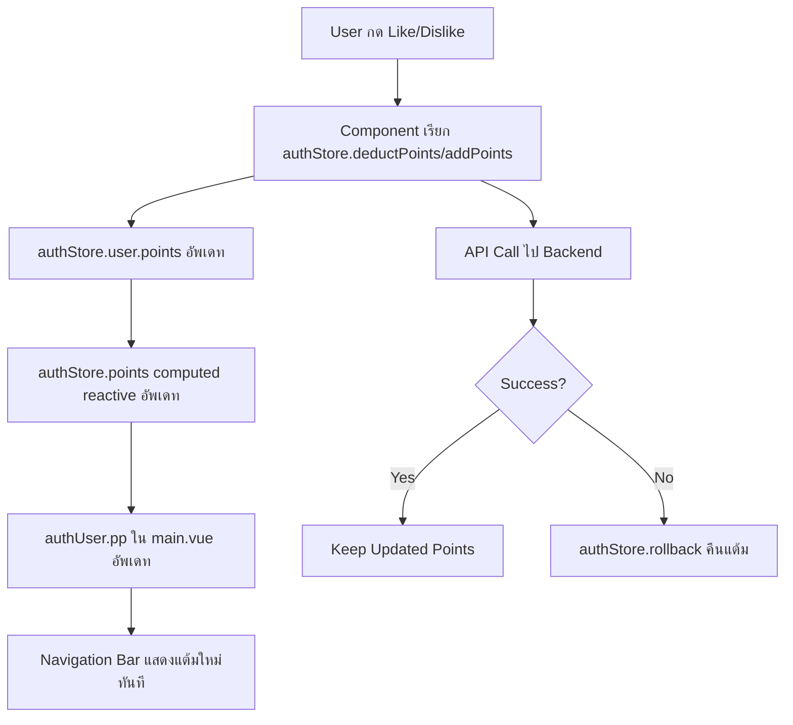

# Real-time Points Update System

## 📋 สรุปการปรับปรุง

ระบบแต้มสะสม (Points) ได้รับการปรับปรุงให้มีการอัพเดทแบบ Real-time ใน Navigation Bar และทุกส่วนของแอพพลิเคชันเมื่อผู้ใช้กด Like หรือ Dislike

## ✨ คุณสมบัติหลัก

### 1. **Reactive Points System**
- ใช้ `authStore.points` (computed property) แทน `usePage().props.auth.user.pp`
- แต้มจะอัพเดททันทีในทุก component ที่ใช้งาน
- ไม่ต้องรอการ refresh หน้าเว็บ

### 2. **Centralized State Management**
- จัดการแต้มผ่าน Pinia Store (`useAuthStore`)
- มี functions ที่ชัดเจน:
  - `deductPoints(amount)` - ตัดแต้ม
  - `addPoints(amount)` - เพิ่มแต้ม
  - `rollback(amount)` - คืนแต้มกรณี error

### 3. **Real-time Display**
- แสดงแต้มใน Navigation Bar (Header)
- อัพเดททันทีเมื่อมีการ:
  - Like/Unlike โพสต์
  - Dislike/Undislike โพสต์
  - Like/Dislike บทเรียน
  - Like/Dislike รูปภาพ

## 🔧 ไฟล์ที่ได้รับการปรับปรุง

### Layout
- `ui/layouts/main.vue`
  - ใช้ `authStore.points` ใน computed `authUser.pp`
  - แสดงแต้มแบบ Real-time ใน Header

### Post Reactions
1. **Play Posts**
   - `ui/PlearndComponents/play/posts/PostViewerPartials/PostReactionViewer.vue`
   - `ui/PlearndComponents/play/posts/PostViewerPartials/PostImages/PostImageReactionViewer.vue`

2. **Course Posts**
   - `ui/PlearndComponents/learn/courses/posts/CoursePostReactionViewer.vue`
   - `ui/PlearndComponents/learn/courses/posts/PostViewerPartials/PostReactionViewer.vue`
   - `ui/PlearndComponents/learn/courses/posts/PostViewerPartials/PostImages/CoursePostImageReactionViewer.vue`
   - `ui/PlearndComponents/learn/courses/posts/LazyCoursePostReactionViewer.vue`

3. **Academy Posts**
   - `ui/PlearndComponents/learn/academies/posts/AcademyPostReactionViewer.vue`

### Lesson Reactions
- `ui/PlearndComponents/learn/courses/lessons/LessonReactions/LessonReactionViewer.vue`

### Auth Store
- `ui/stores/auth.ts`
  - มี computed `points` สำหรับ reactive updates
  - มี functions สำหรับจัดการแต้ม

## 📊 โครงสร้างการทำงาน



## 💰 กฎการใช้แต้ม

### Like/Unlike
- **Like**: ตัดแต้ม 24 แต้ม (Play Posts) หรือ 12 แต้ม (Course Posts)
- **Unlike**: คืนแต้ม 12 แต้ม

### Dislike/Undislike
- **Dislike**: ตัดแต้ม 12 แต้ม
- **Undislike**: คืนแต้ม 12 แต้ม

### การเปลี่ยนจาก Like เป็น Dislike (หรือกลับกัน)
- ระบบจะคำนวณแต้มที่ถูกต้องโดยอัตโนมัติ

## 🔍 ตัวอย่างการใช้งาน

### ใน Component
```vue
<script setup>
import { useAuthStore } from '@/stores/auth'

const authStore = useAuthStore()

// ตัดแต้มเมื่อกด Like
const handleLike = () => {
  const success = authStore.deductPoints(24)
  if (success) {
    // API call
    // ถ้า API error ให้ rollback
    authStore.rollback(24)
  }
}

// คืนแต้มเมื่อ Unlike
const handleUnlike = () => {
  authStore.addPoints(12)
  // API call
}
</script>
```

### แสดงแต้มใน Template
```vue
<template>
  <!-- แต้มจะอัพเดทอัตโนมัติ -->
  <div>แต้มสะสม: {{ authStore.points }}</div>
</template>
```

## ✅ ข้อดีของระบบใหม่

1. **Real-time Update** - เห็นผลทันทีไม่ต้อง refresh
2. **Centralized** - จัดการแต้มในที่เดียว
3. **Type-safe** - มี TypeScript support
4. **Reactive** - ใช้ Vue 3 Composition API
5. **Error Handling** - มีระบบ rollback กรณี error
6. **Logging** - มี console.log ติดตามการทำงาน

## 🐛 การแก้ไขปัญหา

### แต้มไม่อัพเดท
1. ตรวจสอบว่าใช้ `authStore.points` แทน `usePage().props.auth.user.pp`
2. ตรวจสอบว่า component import `useAuthStore` ถูกต้อง
3. เปิด DevTools Console ดู log การ deduct/add points

### แต้มไม่ถูกต้อง
1. ตรวจสอบว่า rollback ทำงานเมื่อ API error
2. ตรวจสอบ Backend response
3. ดู console.log เพื่อติดตามการคำนวณแต้ม

## 📝 สิ่งที่ต้องทำเพิ่มเติม (ถ้าต้องการ)

1. ✅ อัพเดทไฟล์อื่นๆ ที่ยังใช้ `usePage().props.auth.user.pp`:
   - `ui/PlearndComponents/learn/courses/lessons/CourseLessonsList.vue`
   - `ui/PlearndComponents/learn/courses/groups/CourseGroupItem.vue`
   - `ui/PlearndComponents/learn/courses/questions/QuestionItem.vue`
   - `ui/pages/Support/Donate/Donates.vue`

2. ✅ เพิ่ม Animation เมื่อแต้มเปลี่ยน (fade, pulse, etc.)

3. ✅ เพิ่ม Toast Notification เมื่อแต้มไม่พอ

---

**วันที่อัพเดท**: 23 ธันวาคม 2025  
**เวอร์ชัน**: 1.0.0
