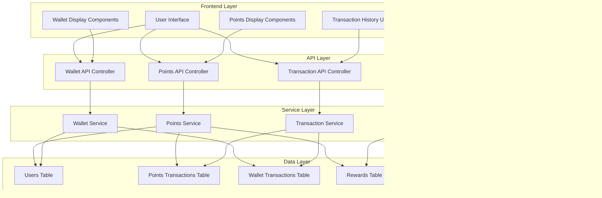

# ระบบแต้มสะสมและ Wallet แบบครบวงจร
# Comprehensive Points Accumulation and Wallet System

## สารบัญ (Table of Contents)
1. [ภาพรวมระบบ (System Overview)](#ภาพรวมระบบ-system-overview)
2. [สถาปัตยกรรมระบบ (System Architecture)](#สถาปัตยกรรมระบบ-system-architecture)
3. [การออกแบบฐานข้อมูล (Database Design)](#การออกแบบฐานข้อมูล-database-design)
4. [กลไกการสะสมแต้ม (Points Earning Mechanisms)](#กลไกการสะสมแต้ม-points-earning-mechanisms)
5. [กลไกการใช้แต้ม (Points Spending Mechanisms)](#กลไกการใช้แต้ม-points-spending-mechanisms)
6. [ระบบ Wallet (Wallet System)](#ระบบ-wallet-wallet-system)
7. [ประวัติธุรกรรม (Transaction History)](#ประวัติธุรกรรม-transaction-history)
8. [ระบบ Gamification (Gamification System)](#ระบบ-gamification-gamification-system)
9. [API Endpoints](#api-endpoints)
10. [Frontend Components](#frontend-components)
11. [Admin Features](#admin-features)
12. [แผนการพัฒนา (Implementation Roadmap)](#แผนการพัฒนา-implementation-roadmap)

---

## ภาพรวมระบบ (System Overview)

### วัตถุประสงค์ (Objectives)
- สร้างระบบแต้มสะสมและ wallet ที่ครบวงจร มีประสิทธิภาพ และปลอดภัย
- ส่งเสริมการมีส่วนร่วมของผู้ใช้ผ่านระบบ gamification
- จัดการธุรกรรมทุกประเภทอย่างโปร่งใส
- รองรับการแปลงระหว่างแต้มและเงิน
- มีระบบรางวัลและความสำเร็จ

### แนวคิดหลัก (Core Concepts)

#### 1. แต้มสะสม (Points - PP)

**⚠️ หลักการสำคัญ**: ระบบไม่ได้สร้างแต้มอัตโนมัติ เพราะแต้มสามารถแลกเป็นเงินได้ ดังนั้นแต้มทั้งหมดต้องมาจากแหล่งที่มาที่มีเงินจริง

##### 1.1 แหล่งที่มาของแต้ม (Points Sources)

**แต้มจากระบบ (System Points)**:
- แต้มที่มาจากแหล่งที่มาภายนอกที่มีเงินจริง
- ค่าโฆษณา (Ad Revenue): รายได้จากโฆษณาถูกแปลงเป็นแต้ม
- การบริจาค (Donations): เงินบริจาคถูกแปลงเป็นแต้ม
- ค่าเรียน (Tuition Fees): ค่าเรียนบางส่วนถูกแปลงเป็นแต้ม (ถ้ามีนโยบาย)

**แต้มที่โอนระหว่างผู้ใช้ (User-to-User Points)**:
- แต้มที่ถูกโอนจากผู้ใช้หนึ่งไปยังอีกคนหนึ่ง
- ไม่ได้เพิ่มหรือลดแต้มในระบบโดยรวม
- กดไลค์: ผู้กดใช้ 24 แต้ม → เจ้าของได้ 12 แต้ม
- กดแชร์: ผู้แชร์ใช้ 36 แต้ม → เจ้าของได้ 18 แต้ม
- คอมเมนต์: ผู้คอมเมนต์ใช้ 12 แต้ม → เจ้าของได้ 6 แต้ม

##### 1.2 ประเภทแต้ม
- **แต้มหลัก (Primary Points/PP)**: แต้มที่ได้จากการมีส่วนร่วมในระบบ
- **แต้มโบนัส (Bonus Points)**: แต้มพิเศษจากกิจกรรมพิเศษ
- **แต้มที่ใช้ได้ (Available Points)**: แต้มที่สามารถใช้งานได้ทันที
- **แต้มที่ถูกล็อก (Locked Points)**: แต้มที่รอการปลดล็อกจากเงื่อนไขบางอย่าง

#### 2. Wallet

##### 2.1 แหล่งที่มาของเงินใน Wallet
- **ค่าโฆษณา (Ad Revenue)**: รายได้จากโฆษณาที่ผู้ใช้ดู
- **การบริจาค (Donations)**: เงินที่ได้จากการบริจาค
- **การแปลงแต้มเป็นเงิน**: ผู้ใช้แลกแต้มเป็นเงิน
- **การฝากเงิน**: ผู้ใช้ฝากเงินเข้าระบบ (ถ้ามีนโยบาย)

##### 2.2 ประเภท Wallet
- **เงินสด (Cash Balance)**: เงินที่สามารถถอนได้
- **เงินรางวัล (Reward Balance)**: เงินที่ได้จากการแปลงแต้ม
- **เงินที่ถูกล็อก (Locked Balance)**: เงินที่รอการปลดล็อก

#### 3. อัตราแลกเปลี่ยน (Exchange Rate)
- **แลกแต้มเป็นเงิน**: 1,200 แต้ม = 1 บาท
- **แลกเงินเป็นแต้ม**: 1 บาท = 1,080 แต้ม (สำหรับสนับสนุนโฆษณา)
- **1 แต้ม = 0.000833 บาท**
- สามารถปรับเปลี่ยนได้ตามนโยบาย

---

## สถาปัตยกรรมระบบ (System Architecture)

### แผนภาพสถาปัตยกรรม (Architecture Diagram)



### แผนภาพการไหลของข้อมูล (Data Flow Diagram)


---

## การออกแบบฐานข้อมูล (Database Design)

### ตารางที่มีอยู่ (Existing Tables)
- `users` - มีฟิลด์ `pp` (แต้ม) และ `wallet` (เงิน)

### ตารางใหม่ที่ต้องสร้าง (New Tables to Create)

#### 1. points_transactions
บันทึกประวัติการทำธุรกรรมแต้มทั้งหมด

```sql
CREATE TABLE points_transactions (
    id BIGINT UNSIGNED AUTO_INCREMENT PRIMARY KEY,
    user_id BIGINT UNSIGNED NOT NULL,
    transaction_type ENUM('earn', 'spend', 'refund', 'transfer', 'admin_adjust', 'conversion') NOT NULL,
    amount DECIMAL(10, 2) NOT NULL,
    balance_before DECIMAL(10, 2) NOT NULL,
    balance_after DECIMAL(10, 2) NOT NULL,
    source_type VARCHAR(50) NULL, -- 'post', 'like', 'share', 'quiz', 'assignment', etc.
    source_id BIGINT UNSIGNED NULL,
    description TEXT NULL,
    metadata JSON NULL,
    status ENUM('pending', 'completed', 'failed', 'cancelled') DEFAULT 'completed',
    created_at TIMESTAMP DEFAULT CURRENT_TIMESTAMP,
    updated_at TIMESTAMP DEFAULT CURRENT_TIMESTAMP ON UPDATE CURRENT_TIMESTAMP,
    
    INDEX idx_user_id (user_id),
    INDEX idx_transaction_type (transaction_type),
    INDEX idx_source (source_type, source_id),
    INDEX idx_created_at (created_at),
    FOREIGN KEY (user_id) REFERENCES users(id) ON DELETE CASCADE
);
```

#### 2. wallet_transactions
บันทึกประวัติการทำธุรกรรมเงินใน wallet

```sql
CREATE TABLE wallet_transactions (
    id BIGINT UNSIGNED AUTO_INCREMENT PRIMARY KEY,
    user_id BIGINT UNSIGNED NOT NULL,
    transaction_type ENUM('deposit', 'withdraw', 'transfer', 'conversion', 'admin_adjust', 'reward') NOT NULL,
    amount DECIMAL(10, 2) NOT NULL,
    balance_before DECIMAL(10, 2) NOT NULL,
    balance_after DECIMAL(10, 2) NOT NULL,
    currency VARCHAR(3) DEFAULT 'THB',
    description TEXT NULL,
    metadata JSON NULL,
    status ENUM('pending', 'completed', 'failed', 'cancelled') DEFAULT 'completed',
    reference_number VARCHAR(50) NULL,
    created_at TIMESTAMP DEFAULT CURRENT_TIMESTAMP,
    updated_at TIMESTAMP DEFAULT CURRENT_TIMESTAMP ON UPDATE CURRENT_TIMESTAMP,
    
    INDEX idx_user_id (user_id),
    INDEX idx_transaction_type (transaction_type),
    INDEX idx_created_at (created_at),
    INDEX idx_reference (reference_number),
    FOREIGN KEY (user_id) REFERENCES users(id) ON DELETE CASCADE
);
```

#### 3. point_rules
กำหนดกฎการได้และใช้แต้ม

```sql
CREATE TABLE point_rules (
    id BIGINT UNSIGNED AUTO_INCREMENT PRIMARY KEY,
    rule_key VARCHAR(100) UNIQUE NOT NULL,
    rule_name VARCHAR(255) NOT NULL,
    description TEXT NULL,
    action_type ENUM('earn', 'spend') NOT NULL,
    source_type VARCHAR(50) NOT NULL,
    base_amount DECIMAL(10, 2) NOT NULL,
    multiplier DECIMAL(5, 2) DEFAULT 1.00,
    max_daily_earnings INT NULL,
    max_monthly_earnings INT NULL,
    cooldown_minutes INT NULL,
    is_active BOOLEAN DEFAULT TRUE,
    effective_date DATE NULL,
    expiry_date DATE NULL,
    created_at TIMESTAMP DEFAULT CURRENT_TIMESTAMP,
    updated_at TIMESTAMP DEFAULT CURRENT_TIMESTAMP ON UPDATE CURRENT_TIMESTAMP,
    
    INDEX idx_rule_key (rule_key),
    INDEX idx_source_type (source_type),
    INDEX idx_is_active (is_active)
);
```

#### 4. rewards
รางวัลที่ผู้ใช้สามารถแลกได้

```sql
CREATE TABLE rewards (
    id BIGINT UNSIGNED AUTO_INCREMENT PRIMARY KEY,
    name VARCHAR(255) NOT NULL,
    description TEXT NULL,
    type ENUM('points', 'wallet', 'badge', 'feature', 'discount') NOT NULL,
    value DECIMAL(10, 2) NOT NULL,
    points_cost INT NOT NULL,
    image_url VARCHAR(500) NULL,
    stock INT NULL,
    max_redemptions_per_user INT NULL,
    is_active BOOLEAN DEFAULT TRUE,
    available_from DATETIME NULL,
    available_until DATETIME NULL,
    created_at TIMESTAMP DEFAULT CURRENT_TIMESTAMP,
    updated_at TIMESTAMP DEFAULT CURRENT_TIMESTAMP ON UPDATE CURRENT_TIMESTAMP,
    
    INDEX idx_type (type),
    INDEX idx_is_active (is_active),
    INDEX idx_availability (available_from, available_until)
);
```

#### 5. user_rewards
บันทึกการแลกรางวัลของผู้ใช้

```sql
CREATE TABLE user_rewards (
    id BIGINT UNSIGNED AUTO_INCREMENT PRIMARY KEY,
    user_id BIGINT UNSIGNED NOT NULL,
    reward_id BIGINT UNSIGNED NOT NULL,
    points_spent INT NOT NULL,
    status ENUM('pending', 'claimed', 'expired', 'cancelled') DEFAULT 'pending',
    redeemed_at TIMESTAMP NULL,
    expires_at TIMESTAMP NULL,
    metadata JSON NULL,
    created_at TIMESTAMP DEFAULT CURRENT_TIMESTAMP,
    updated_at TIMESTAMP DEFAULT CURRENT_TIMESTAMP ON UPDATE CURRENT_TIMESTAMP,
    
    INDEX idx_user_id (user_id),
    INDEX idx_reward_id (reward_id),
    INDEX idx_status (status),
    FOREIGN KEY (user_id) REFERENCES users(id) ON DELETE CASCADE,
    FOREIGN KEY (reward_id) REFERENCES rewards(id) ON DELETE CASCADE
);
```

#### 6. achievements
ความสำเร็จที่ผู้ใช้สามารถบรรลุได้

```sql
CREATE TABLE achievements (
    id BIGINT UNSIGNED AUTO_INCREMENT PRIMARY KEY,
    name VARCHAR(255) NOT NULL,
    description TEXT NULL,
    icon VARCHAR(500) NULL,
    type ENUM('points', 'actions', 'streak', 'social', 'learning') NOT NULL,
    criteria JSON NOT NULL, -- เก็บเงื่อนไขการบรรลุ
    points_reward INT DEFAULT 0,
    badge_url VARCHAR(500) NULL,
    is_active BOOLEAN DEFAULT TRUE,
    created_at TIMESTAMP DEFAULT CURRENT_TIMESTAMP,
    updated_at TIMESTAMP DEFAULT CURRENT_TIMESTAMP ON UPDATE CURRENT_TIMESTAMP,
    
    INDEX idx_type (type),
    INDEX idx_is_active (is_active)
);
```

#### 7. user_achievements
บันทึกความสำเร็จของผู้ใช้

```sql
CREATE TABLE user_achievements (
    id BIGINT UNSIGNED AUTO_INCREMENT PRIMARY KEY,
    user_id BIGINT UNSIGNED NOT NULL,
    achievement_id BIGINT UNSIGNED NOT NULL,
    progress INT DEFAULT 0,
    is_completed BOOLEAN DEFAULT FALSE,
    completed_at TIMESTAMP NULL,
    metadata JSON NULL,
    created_at TIMESTAMP DEFAULT CURRENT_TIMESTAMP,
    updated_at TIMESTAMP DEFAULT CURRENT_TIMESTAMP ON UPDATE CURRENT_TIMESTAMP,
    
    UNIQUE KEY unique_user_achievement (user_id, achievement_id),
    INDEX idx_user_id (user_id),
    INDEX idx_achievement_id (achievement_id),
    INDEX idx_is_completed (is_completed),
    FOREIGN KEY (user_id) REFERENCES users(id) ON DELETE CASCADE,
    FOREIGN KEY (achievement_id) REFERENCES achievements(id) ON DELETE CASCADE
);
```

#### 8. point_streaks
บันทึกสถิติการเข้าใช้งานต่อเนื่อง

```sql
CREATE TABLE point_streaks (
    id BIGINT UNSIGNED AUTO_INCREMENT PRIMARY KEY,
    user_id BIGINT UNSIGNED NOT NULL,
    current_streak INT DEFAULT 0,
    longest_streak INT DEFAULT 0,
    last_activity_date DATE NULL,
    bonus_points_earned INT DEFAULT 0,
    created_at TIMESTAMP DEFAULT CURRENT_TIMESTAMP,
    updated_at TIMESTAMP DEFAULT CURRENT_TIMESTAMP ON UPDATE CURRENT_TIMESTAMP,
    
    UNIQUE KEY unique_user_streak (user_id),
    INDEX idx_current_streak (current_streak),
    FOREIGN KEY (user_id) REFERENCES users(id) ON DELETE CASCADE
);
```

#### 9. daily_point_limits
จำกัดการได้แต้มต่อวัน

```sql
CREATE TABLE daily_point_limits (
    id BIGINT UNSIGNED AUTO_INCREMENT PRIMARY KEY,
    user_id BIGINT UNSIGNED NOT NULL,
    date DATE NOT NULL,
    points_earned INT DEFAULT 0,
    points_spent INT DEFAULT 0,
    created_at TIMESTAMP DEFAULT CURRENT_TIMESTAMP,
    updated_at TIMESTAMP DEFAULT CURRENT_TIMESTAMP ON UPDATE CURRENT_TIMESTAMP,
    
    UNIQUE KEY unique_user_date (user_id, date),
    INDEX idx_date (date),
    FOREIGN KEY (user_id) REFERENCES users(id) ON DELETE CASCADE
);
```

### การอัปเดตตาราง users
เพิ่มฟิลด์ใหม่เพื่อรองรับระบบ

```sql
ALTER TABLE users ADD COLUMN total_points_earned BIGINT DEFAULT 0 AFTER pp;
ALTER TABLE users ADD COLUMN total_points_spent BIGINT DEFAULT 0 AFTER total_points_earned;
ALTER TABLE users ADD COLUMN level INT DEFAULT 1 AFTER total_points_spent;
ALTER TABLE users ADD COLUMN xp_for_next_level BIGINT DEFAULT 100 AFTER level;
ALTER TABLE users ADD COLUMN current_xp BIGINT DEFAULT 0 AFTER xp_for_next_level;
```

---

## กลไกการสะสมแต้ม (Points Earning Mechanisms)

### 1. แต้มจากระบบ (System Points Earning)

#### 1.1 การดูโฆษณา (Ad Viewing)
- **ดูโฆษณา**: +4% ของ duration เป็นเงิน wallet
- **แปลงเป็นแต้ม**: 1 บาท = 1,080 แต้ม
- **ตัวอย่าง**: ดูโฆษณา 30 วินาที → ได้ 1.2 บาท → ได้ 1,296 แต้ม

#### 1.2 การบริจาค (Donations)
- **รับบริจาค**: +240 แต้ม/ครั้ง (แปลงเงินบริจาคเป็นแต้ม)
- **ตัวอย่าง**: รับบริจาค 1 บาท → ได้ 1,080 แต้ม

#### 1.3 การเรียนรู้ (Learning) - ถ้ามีนโยบาย
- **เข้าเรียนบทเรียน**: +10-50 แต้ม (ขึ้นกับระดับ)
- **ทำแบบฝึกหัดถูก**: +คะแนนที่ได้ (จากส่วนแบ่งค่าเรียน)
- **ส่งงาน**: +5-20 แต้ม (จากส่วนแบ่งค่าเรียน)
- **ผ่านแบบทดสอบ**: +50-200 แต้ม (จากส่วนแบ่งค่าเรียน)

#### 1.4 การโหวต (Polling)
- **โหวต**: +points_per_vote แต้ม (จาก pool ที่ผู้สร้างโพลใส่)
- **สร้างโพล**: -180 แต้ม + points_pool (pool มาจากผู้สร้าง)

#### 1.5 โบนัสพิเศษ (Special Bonuses) - ถ้ามีนโยบาย
- **Daily Login**: +10-50 แต้ม/วัน (จากโฆษณา)
- **Weekly Login**: +100-500 แต้ม/สัปดาห์ (จากโฆษณา)
- **Monthly Login**: +500-2000 แต้ม/เดือน (จากโฆษณา)
- **Referral**: +500-1000 แต้ม/คน (จากโฆษณา)
- **Birthday**: +1000 แต้ม (จากโฆษณา)
- **Level Up**: +100 × level แต้ม (จากโฆษณา)

### 2. แต้มที่โอนระหว่างผู้ใช้ (User-to-User Points Transfer)

#### 2.1 การโต้ตอบ (Interactions)
- **กดไลค์โพสต์**: ผู้กดใช้ 24 แต้ม → เจ้าของได้ 12 แต้ม
- **ยกเลิกไลค์**: ผู้กดใช้ 12 แต้ม → เจ้าของเสีย 12 แต้ม
- **กดดิสไลค์**: ผู้กดใช้ 12 แต้ม → เจ้าของเสีย 12 แต้ม
- **แชร์โพสต์**: ผู้แชร์ใช้ 36 แต้ม → เจ้าของได้ 18 แต้ม
- **คอมเมนต์**: ผู้คอมเมนต์ใช้ 12 แต้ม → เจ้าของได้ 6 แต้ม
- **ตอบคอมเมนต์**: ผู้ตอบใช้ 12 แต้ม → เจ้าของคอมเมนต์ได้ 6 แต้ม

#### 2.2 การโพสต์ (Posting)
- **โพสต์ทั่วไป**: ไม่ได้แต้มจากระบบ (แต่สามารถได้แต้มจากการโต้ตอบ)
- **โพสต์พร้อมรูปภาพ**: ไม่ได้แต้มจากระบบ (แต่สามารถได้แต้มจากการโต้ตอบ)
- **โพสต์พร้อมโพล**: ไม่ได้แต้มจากระบบ (แต่สามารถได้แต้มจากการโต้ตอบ)

### 3. การสนับสนุน (Support)
- **สนับสนุนโฆษณา**: แลกเปลี่ยนเงิน → แต้ม (1 บาท = 1,080 แต้ม)
- **วัตถุประสงค์**: ให้ผู้ใช้สามารถสนับสนุนโฆษณาเพื่อรับแต้ม

### 9. สูตรการคำนวณแต้ม (Points Calculation Formulas)

#### สูตรคำนวณ Level
```
Level = floor((Points / 100) ^ (2/3))
XP for Next Level = 100 × (Level + 1)^1.5
Current XP = Points - Total XP for Current Level
```

#### สูตรคำนวณ Streak Bonus
```
Streak Bonus = Base Bonus × (1 + (Streak Days × 0.1))
Max Bonus = Base Bonus × 5
```

#### สูตรคำนวณ Multiplier
```
Multiplier = Base Multiplier × (1 + (Level × 0.05))
Max Multiplier = 2.0
```

---

## กลไกการใช้แต้ม (Points Spending Mechanisms)

### 1. การโต้ตอบ (Interactions) - โอนแต้มให้เจ้าของ
- **กดไลค์**: 24 แต้ม (โอน 12 แต้มให้เจ้าของ)
- **ยกเลิกไลค์**: 12 แต้ม (คืนครึ่ง)
- **กดดิสไลค์**: 12 แต้ม (โอน -12 แต้มให้เจ้าของ)
- **แชร์**: 36 แต้ม (โอน 18 แต้มให้เจ้าของ)
- **คอมเมนต์**: 12 แต้ม (โอน 6 แต้มให้เจ้าของ)
- **ตอบคอมเมนต์**: 12 แต้ม (โอน 6 แต้มให้เจ้าของคอมเมนต์)

### 2. การเข้าถึงเนื้อหา (Content Access) - ถ้ามีนโยบาย
- **เข้าบทเรียน**: point_tuition_fee แต้ม
- **เข้าสมาคม**: membership_fees_points แต้ม
- **สร้างคอร์ส**: 100 แต้ม

### 3. การสร้างเนื้อหา (Content Creation)
- **สร้างโพล**: 180 แต้ม + points_pool (pool มาจากผู้สร้าง)
- **สร้างคำถาม**: 1-100 แต้ม (ถ้ามีนโยบาย)

### 4. การแลกรางวัล (Reward Redemption)
- **แลกเงิน**: 1,200 แต้ม = 1 บาท
- **แลกบัตรกำนัล**: ตามราคาที่กำหนด
- **แลกฟีเจอร์พิเศษ**: ตามราคาที่กำหนด
- **แลก Badge**: ตามราคาที่กำหนด

### 5. การบริจาค (Donations)
- **บริจาค**: 270 แต้ม/ครั้ง (โอนแต้มให้ผู้รับ)

### 6. การแปลงแต้ม (Points Conversion)
- **แปลงเป็นเงิน**: 1,200 แต้ม = 1 บาท
- **แปลงเป็น wallet**: 1,200 แต้ม = 1 บาท

### 7. การซื้อฟีเจอร์ (Feature Purchases)
- **เปลี่ยนชื่อผู้ใช้**: 500 แต้ม
- **เปลี่ยนรูปโปรไฟล์พิเศษ**: 200 แต้ม
- **ปลดล็อกธีมพิเศษ**: 1000 แต้ม
- **เพิ่มพื้นที่จัดเก็บ**: 100 แต้ม/GB

### 8. การใช้แต้มสำหรับโฆษณา (Ad Spending)
- **สร้างโฆษณา**: 20 แต้ม × duration
- **เพิ่มการแสดงผล**: 10 แต้ม × จำนวนครั้ง

---

## ระบบ Wallet (Wallet System)

### แหล่งที่มาของเงินใน Wallet (Wallet Income Sources)

#### 1. ค่าโฆษณา (Ad Revenue)
- รายได้จากโฆษณาที่ผู้ใช้ดู
- แปลงเป็นแต้ม: 1 บาท = 1,080 แต้ม
- แปลงเป็นเงิน: 1,200 แต้ม = 1 บาท

#### 2. การบริจาค (Donations)
- เงินที่ได้จากการบริจาค
- แปลงเป็นแต้ม: 1 บาท = 1,080 แต้ม

#### 3. การแปลงแต้มเป็นเงิน (Points to Money Conversion)
- ผู้ใช้แลกแต้มเป็นเงิน
- อัตรา: 1,200 แต้ม = 1 บาท

#### 4. การฝากเงิน (Deposit) - ถ้ามีนโยบาย
- ผู้ใช้ฝากเงินเข้าระบบ
- ผ่านธนาคาร, บัตรเครดิต

### ประเภท Wallet (Wallet Types)

#### 1. Cash Balance (เงินสด)
- เงินที่สามารถถอนได้
- ได้จากการแปลงแต้ม
- ได้จากการรับบริจาค
- ได้จากการดูโฆษณา

#### 2. Reward Balance (เงินรางวัล)
- เงินที่ได้จากการบรรลุเป้าหมาย
- เงินที่ได้จากการแข่งขัน
- อาจมีเงื่อนไขในการถอน

#### 3. Locked Balance (เงินที่ถูกล็อก)
- เงินที่รอการปลดล็อก
- เงินที่ถูกถือไว้ชั่วคราว
- เงินที่อยู่ระหว่างการทำธุรกรรม

### การจัดการ Wallet (Wallet Management)

#### การฝากเงิน (Deposit)
```php
// API Endpoint: POST /api/wallet/deposit
{
    "amount": 100.00,
    "method": "bank_transfer",
    "reference": "REF123456"
}
```

#### การถอนเงิน (Withdraw)
```php
// API Endpoint: POST /api/wallet/withdraw
{
    "amount": 50.00,
    "method": "bank_transfer",
    "bank_account": {
        "bank_name": "KBank",
        "account_number": "1234567890",
        "account_name": "John Doe"
    }
}
```

#### การโอนเงิน (Transfer)
```php
// API Endpoint: POST /api/wallet/transfer
{
    "recipient_id": 123,
    "amount": 100.00,
    "message": "Thanks for the help!"
}
```

#### การแปลงแต้มเป็นเงิน (Points to Money Conversion)
```php
// API Endpoint: POST /api/wallet/convert-points
{
    "points": 1200,
    "target": "wallet"
}
// Result: +1.00 THB to wallet
```

### จำกัดการใช้งาน (Usage Limits)
- **ถอนขั้นต่ำ**: 100 บาท
- **ถอนขั้นสูง**: 50,000 บาท/ครั้ง
- **ถอนสูงสุด/วัน**: 200,000 บาท
- **ถอนสูงสุด/เดือน**: 1,000,000 บาท
- **ค่าธรรมเนียม**: 0.5% (ขั้นต่ำ 10 บาท)

---

## ประวัติธุรกรรม (Transaction History)

### ประเภทธุรกรรมแต้ม (Points Transaction Types)

#### 1. System Earn (การได้แต้มจากระบบ)
- `ad_view`: ดูโฆษณา
- `donation_received`: รับบริจาค
- `quiz_complete`: ทำแบบทดสอบ (ถ้ามีนโยบาย)
- `assignment_submit`: ส่งงาน (ถ้ามีนโยบาย)
- `daily_login`: เข้าสู่ระบบประจำวัน (ถ้ามีนโยบาย)
- `streak_bonus`: โบนัสการเข้าต่อเนื่อง (ถ้ามีนโยบาย)
- `achievement_complete`: บรรลุความสำเร็จ (ถ้ามีนโยบาย)
- `referral`: แนะนำเพื่อน (ถ้ามีนโยบาย)
- `poll_vote`: โหวต (จาก pool ของโพล)

#### 2. User-to-User Transfer (การโอนแต้มระหว่างผู้ใช้)
- `post_like_received`: รับไลค์ (จากผู้กด)
- `post_like_given`: กดไลค์ (ให้เจ้าของ)
- `post_unlike_given`: ยกเลิกไลค์ (คืนให้ผู้กด)
- `post_dislike_received`: รับดิสไลค์ (จากผู้กด)
- `post_dislike_given`: กดดิสไลค์ (ให้เจ้าของ)
- `post_share_received`: รับการแชร์ (จากผู้แชร์)
- `post_share_given`: แชร์ (ให้เจ้าของ)
- `comment_received`: รับคอมเมนต์ (จากผู้คอมเมนต์)
- `comment_given`: คอมเมนต์ (ให้เจ้าของ)
- `reply_received`: รับการตอบกลับ (จากผู้ตอบ)
- `reply_given`: ตอบกลับ (ให้เจ้าของคอมเมนต์)

#### 3. Spend (การใช้แต้ม)
- `lesson_access`: เข้าบทเรียน (ถ้ามีนโยบาย)
- `course_create`: สร้างคอร์ส
- `poll_create`: สร้างโพล
- `reward_redeem`: แลกรางวัล
- `donation_give`: บริจาค (โอนแต้มให้ผู้รับ)
- `ad_create`: สร้างโฆษณา

#### 4. Refund (การคืนแต้ม)
- `transaction_refund`: คืนแต้มจากธุรกรรม
- `error_correction`: แก้ไขข้อผิดพลาด

#### 5. Admin Adjust (การปรับจาก admin)
- `admin_add`: admin เพิ่มแต้ม
- `admin_deduct`: admin หักแต้ม
- `admin_reset`: admin รีเซ็ตแต้ม

#### 6. Conversion (การแปลง)
- `points_to_wallet`: แปลงแต้มเป็นเงิน
- `wallet_to_points`: แปลงเงินเป็นแต้ม (สำหรับสนับสนุนโฆษณา)

### ประเภทธุรกรรม Wallet (Wallet Transaction Types)

#### 1. Ad Revenue (รายได้จากโฆษณา)
- `ad_view_revenue`: รายได้จากการดูโฆษณา

#### 2. Donation (การบริจาค)
- `donation_received`: รับบริจาค

#### 3. Deposit (การฝาก) - ถ้ามีนโยบาย
- `bank_transfer`: โอนผ่านธนาคาร
- `credit_card`: บัตรเครดิต

#### 4. Withdraw (การถอน)
- `bank_transfer`: โอนไปธนาคาร
- `credit_card`: คืนบัตรเครดิต

#### 5. Transfer (การโอน)
- `user_transfer`: โอนให้ผู้ใช้อื่น
- `admin_transfer`: โอนจาก admin

#### 6. Reward (การรับรางวัล)
- `achievement_reward`: รางวัลจากความสำเร็จ
- `contest_reward`: รางวัลจากการแข่งขัน

#### 7. Conversion (การแปลง)
- `points_to_wallet`: แปลงจากแต้ม

#### 8. Admin Adjust (การปรับจาก admin)
- `admin_add`: admin เพิ่มเงิน
- `admin_deduct`: admin หักเงิน

### การแสดงประวัติ (Display Format)

```json
{
    "id": 1,
    "user_id": 123,
    "transaction_type": "earn",
    "amount": 180.00,
    "balance_before": 1000.00,
    "balance_after": 1180.00,
    "source_type": "post",
    "source_id": 456,
    "description": "สร้างโพสต์ใหม่",
    "metadata": {
        "post_title": "สวัสดีทุกคน",
        "has_images": true
    },
    "status": "completed",
    "created_at": "2026-01-13T12:00:00Z"
}
```

### การกรองและค้นหา (Filtering and Search)

```php
// API Endpoint: GET /api/transactions/points
// Query Parameters:
// - type: earn|spend|refund|transfer|admin_adjust|conversion
// - source_type: post|like|share|quiz|assignment|etc.
// - date_from: YYYY-MM-DD
// - date_to: YYYY-MM-DD
// - min_amount: number
// - max_amount: number
// - page: number
// - per_page: number
```

---

## ระบบ Gamification (Gamification System)

### ระดับผู้ใช้ (User Levels)

#### สูตรการคำนวณ Level
```
Level = floor((Total Points / 100) ^ (2/3))
XP for Next Level = 100 × (Level + 1)^1.5
Progress % = (Current XP / XP for Next Level) × 100
```

#### ตาราง Level และ XP

| Level | XP Required | Total Points | Rewards |
|-------|-------------|--------------|---------|
| 1 | 0 | 0 | - |
| 2 | 100 | 100 | +10 แต้ม |
| 3 | 282 | 382 | +20 แต้ม |
| 4 | 520 | 902 | +30 แต้ม |
| 5 | 816 | 1718 | +40 แต้ม |
| 10 | 3162 | 10000 | +100 แต้ม |
| 20 | 12649 | 80000 | +200 แต้ม |
| 50 | 79056 | 1000000 | +500 แต้ม |
| 100 | 316227 | 10000000 | +1000 แต้ม |

### ความสำเร็จ (Achievements)

#### ประเภทความสำเร็จ (Achievement Types)

##### 1. Points Achievements (ความสำเร็จด้านแต้ม)
- **First Steps**: ได้แต้มครั้งแรก (+10 แต้ม)
- **Rising Star**: สะสม 1,000 แต้ม (+100 แต้ม)
- **Point Master**: สะสม 10,000 แต้ม (+1,000 แต้ม)
- **Point Legend**: สะสม 100,000 แต้ม (+10,000 แต้ม)

##### 2. Action Achievements (ความสำเร็จด้านการกระทำ)
- **Social Butterfly**: โพสต์ 10 ครั้ง (+50 แต้ม)
- **Like Magnet**: ได้รับ 100 ไลค์ (+100 แต้ม)
- **Comment King**: คอมเมนต์ 50 ครั้ง (+100 แต้ม)
- **Sharing is Caring**: แชร์ 20 ครั้ง (+100 แต้ม)

##### 3. Streak Achievements (ความสำเร็จด้านการเข้าต่อเนื่อง)
- **Consistent**: เข้า 3 วันต่อเนื่อง (+30 แต้ม)
- **Dedicated**: เข้า 7 วันต่อเนื่อง (+100 แต้ม)
- **Loyal**: เข้า 30 วันต่อเนื่อง (+500 แต้ม)
- **Unstoppable**: เข้า 100 วันต่อเนื่อง (+2,000 แต้ม)

##### 4. Social Achievements (ความสำเร็จด้านสังคม)
- **Friendly**: เพิ่มเพื่อน 10 คน (+50 แต้ม)
- **Popular**: มีเพื่อน 100 คน (+500 แต้ม)
- **Influencer**: มีเพื่อน 1,000 คน (+2,000 แต้ม)

##### 5. Learning Achievements (ความสำเร็จด้านการเรียนรู้)
- **First Lesson**: เข้าเรียนบทเรียนแรก (+20 แต้ม)
- **Quiz Master**: ทำแบบทดสอบ 10 ครั้ง (+200 แต้ม)
- **Assignment Pro**: ส่งงาน 20 ครั้ง (+300 แต้ม)
- **Course Graduate**: จบคอร์ส 1 คอร์ส (+1,000 แต้ม)

### ระบบ Streak (Streak System)

#### การคำนวณ Streak
```php
// ตรวจสอบการเข้าใช้งานล่าสุด
if (lastActivityDate == today) {
    // เข้าใช้งานซ้ำในวันเดียวกัน - ไม่เพิ่ม streak
} elseif (lastActivityDate == yesterday) {
    // เข้าใช้งานต่อเนื่อง - เพิ่ม streak
    currentStreak++;
} else {
    // ขาด - รีเซ็ต streak
    currentStreak = 1;
}
```

#### Streak Bonus
```
Day 1-3: 10 แต้ม/วัน
Day 4-7: 20 แต้ม/วัน
Day 8-14: 30 แต้ม/วัน
Day 15-30: 50 แต้ม/วัน
Day 31+: 100 แต้ม/วัน
```

### ระบบ Leaderboard (Leaderboard System)

#### ประเภท Leaderboard
1. **Points Leaderboard**: อันดับตามแต้มสะสม
2. **Weekly Leaderboard**: อันดับตามแต้มในสัปดาห์
3. **Monthly Leaderboard**: อันดับตามแต้มในเดือน
4. **Streak Leaderboard**: อันดับตาม streak ที่ยาวนานที่สุด
5. **Achievement Leaderboard**: อันดับตามจำนวนความสำเร็จ

#### รางวัล Leaderboard
- **อันดับ 1**: 5,000 แต้ม + Badge พิเศษ
- **อันดับ 2**: 3,000 แต้ม + Badge พิเศษ
- **อันดับ 3**: 1,000 แต้ม + Badge พิเศษ
- **อันดับ 4-10**: 500 แต้ม
- **อันดับ 11-100**: 100 แต้ม

### ระบบ Badge (Badge System)

#### ประเภท Badge
1. **Achievement Badges**: ได้จากการบรรลุความสำเร็จ
2. **Event Badges**: ได้จากการเข้าร่วมอีเวนต์
3. **Special Badges**: ได้จากกิจกรรมพิเศษ
4. **Level Badges**: ได้จากการขึ้น level

#### Rarity Levels (ระดับความหายาก)
- **Common** (สามัญ): 10-50 แต้ม
- **Uncommon** (ไม่สามัญ): 51-100 แต้ม
- **Rare** (หายาก): 101-200 แต้ม
- **Epic** (มหาศาล): 201-500 แต้ม
- **Legendary** (ตำนาน): 501+ แต้ม

---

## API Endpoints

### Points API

#### GET /api/points/balance
รับยอดแต้มปัจจุบัน

```json
{
    "success": true,
    "data": {
        "current_points": 1500.00,
        "total_earned": 5000.00,
        "total_spent": 3500.00,
        "level": 3,
        "current_xp": 382,
        "xp_for_next_level": 520,
        "progress_percentage": 73.46
    }
}
```

#### POST /api/points/earn
รับแต้มจากกิจกรรม

```json
Request:
{
    "source_type": "post",
    "source_id": 123,
    "amount": 180,
    "description": "สร้างโพสต์ใหม่"
}

Response:
{
    "success": true,
    "data": {
        "points_earned": 180,
        "new_balance": 1680.00,
        "transaction_id": 456,
        "achievements_unlocked": [
            {
                "id": 1,
                "name": "Social Butterfly",
                "points_reward": 50
            }
        ]
    }
}
```

#### POST /api/points/spend
ใช้แต้ม

```json
Request:
{
    "source_type": "post_like",
    "source_id": 123,
    "amount": 24,
    "description": "กดไลค์โพสต์"
}

Response:
{
    "success": true,
    "data": {
        "points_spent": 24,
        "new_balance": 1476.00,
        "transaction_id": 457
    }
}
```

#### GET /api/points/transactions
รับประวัติธุรกรรมแต้ม

```json
Query Parameters:
- type: earn|spend|refund|transfer|admin_adjust|conversion
- source_type: post|like|share|quiz|assignment|etc.
- date_from: YYYY-MM-DD
- date_to: YYYY-MM-DD
- page: 1
- per_page: 20

Response:
{
    "success": true,
    "data": [
        {
            "id": 1,
            "transaction_type": "earn",
            "amount": 180.00,
            "balance_before": 1000.00,
            "balance_after": 1180.00,
            "source_type": "post",
            "source_id": 456,
            "description": "สร้างโพสต์ใหม่",
            "status": "completed",
            "created_at": "2026-01-13T12:00:00Z"
        }
    ],
    "pagination": {
        "current_page": 1,
        "total_pages": 5,
        "total_items": 100
    }
}
```

#### POST /api/points/convert
แปลงแต้มเป็นเงิน

```json
Request:
{
    "points": 1200,
    "target": "wallet"
}

Response:
{
    "success": true,
    "data": {
        "points_converted": 1200,
        "wallet_amount": 1.00,
        "new_points_balance": 420.00,
        "new_wallet_balance": 101.00,
        "transaction_ids": {
            "points": 458,
            "wallet": 123
        }
    }
}
```

### Wallet API

#### GET /api/wallet/balance
รับยอดเงินปัจจุบัน

```json
{
    "success": true,
    "data": {
        "cash_balance": 1000.00,
        "reward_balance": 200.00,
        "locked_balance": 50.00,
        "total_balance": 1250.00,
        "currency": "THB"
    }
}
```

#### POST /api/wallet/deposit
ฝากเงิน

```json
Request:
{
    "amount": 100.00,
    "method": "bank_transfer",
    "reference": "REF123456"
}

Response:
{
    "success": true,
    "data": {
        "amount_deposited": 100.00,
        "new_balance": 1100.00,
        "transaction_id": 124,
        "status": "pending"
    }
}
```

#### POST /api/wallet/withdraw
ถอนเงิน

```json
Request:
{
    "amount": 50.00,
    "method": "bank_transfer",
    "bank_account": {
        "bank_name": "KBank",
        "account_number": "1234567890",
        "account_name": "John Doe"
    }
}

Response:
{
    "success": true,
    "data": {
        "amount_withdrawn": 50.00,
        "fee": 0.25,
        "net_amount": 49.75,
        "new_balance": 1050.00,
        "transaction_id": 125,
        "status": "pending",
        "estimated_processing_time": "1-3 วันทำการ"
    }
}
```

#### GET /api/wallet/transactions
รับประวัติธุรกรรม wallet

```json
Response:
{
    "success": true,
    "data": [
        {
            "id": 1,
            "transaction_type": "deposit",
            "amount": 100.00,
            "balance_before": 900.00,
            "balance_after": 1000.00,
            "currency": "THB",
            "description": "ฝากเงินผ่านธนาคาร",
            "status": "completed",
            "reference_number": "REF123456",
            "created_at": "2026-01-13T10:00:00Z"
        }
    ],
    "pagination": {
        "current_page": 1,
        "total_pages": 3,
        "total_items": 50
    }
}
```

### Gamification API

#### GET /api/gamification/achievements
รับรายการความสำเร็จทั้งหมด

```json
{
    "success": true,
    "data": [
        {
            "id": 1,
            "name": "First Steps",
            "description": "ได้แต้มครั้งแรก",
            "icon": "/icons/first-steps.png",
            "type": "points",
            "points_reward": 10,
            "badge_url": "/badges/first-steps.png",
            "is_completed": true,
            "completed_at": "2026-01-10T10:00:00Z",
            "progress": 100
        }
    ]
}
```

#### GET /api/gamification/leaderboard
รับอันดับผู้นำ

```json
Query Parameters:
- type: points|weekly|monthly|streak|achievements
- page: 1
- per_page: 20

Response:
{
    "success": true,
    "data": {
        "type": "points",
        "period": "all_time",
        "leaderboard": [
            {
                "rank": 1,
                "user_id": 123,
                "username": "user123",
                "avatar": "/avatars/123.jpg",
                "score": 50000,
                "level": 10
            }
        ],
        "user_rank": 45
    }
}
```

#### GET /api/gamification/streak
รับข้อมูล streak ปัจจุบัน

```json
{
    "success": true,
    "data": {
        "current_streak": 7,
        "longest_streak": 30,
        "last_activity_date": "2026-01-13",
        "today_login": true,
        "streak_bonus": 20,
        "next_streak_bonus": 30,
        "days_to_next_bonus": 1
    }
}
```

### Rewards API

#### GET /api/rewards
รับรายการรางวัลที่แลกได้

```json
{
    "success": true,
    "data": [
        {
            "id": 1,
            "name": "บัตรกำนัล 100 บาท",
            "description": "แลกบัตรกำนัลมูลค่า 100 บาท",
            "type": "wallet",
            "value": 100.00,
            "points_cost": 120000,
            "image_url": "/rewards/gift-card-100.jpg",
            "stock": 50,
            "max_redemptions_per_user": 5,
            "is_active": true
        }
    ]
}
```

#### POST /api/rewards/redeem
แลกรางวัล

```json
Request:
{
    "reward_id": 1,
    "quantity": 1
}

Response:
{
    "success": true,
    "data": {
        "reward_id": 1,
        "points_spent": 120000,
        "new_points_balance": 420.00,
        "redemption_id": 789,
        "status": "claimed",
        "expires_at": "2026-02-13T23:59:59Z"
    }
}
```

#### GET /api/rewards/my-rewards
รับรางวัลที่แลกแล้ว

```json
{
    "success": true,
    "data": [
        {
            "id": 1,
            "reward_name": "บัตรกำนัล 100 บาท",
            "points_spent": 120000,
            "status": "claimed",
            "redeemed_at": "2026-01-10T10:00:00Z",
            "expires_at": "2026-02-10T23:59:59Z",
            "metadata": {
                "code": "GIFT100-ABC123"
            }
        }
    ]
}
```

---

## Frontend Components

### 1. Points Display Component

#### แสดงยอดแต้ม (Points Balance Display)
```vue
<template>
  <div class="points-display">
    <div class="points-card">
      <div class="points-icon">
        <Icon name="fluent:star-24-filled" />
      </div>
      <div class="points-info">
        <h3 class="points-value">{{ formatPoints(userPoints) }}</h3>
        <p class="points-label">แต้มสะสม</p>
      </div>
      <div class="points-actions">
        <button @click="showHistory" class="btn-history">
          <Icon name="fluent:history-24-regular" />
          ประวัติ
        </button>
        <button @click="showConvert" class="btn-convert">
          <Icon name="fluent:arrow-swap-24-regular" />
          แปลงเงิน
        </button>
      </div>
    </div>
    
    <div class="level-progress" v-if="showLevel">
      <div class="level-info">
        <span class="level-number">Level {{ userLevel }}</span>
        <span class="level-progress-text">{{ progressPercentage }}%</span>
      </div>
      <div class="progress-bar">
        <div 
          class="progress-fill" 
          :style="{ width: progressPercentage + '%' }"
        ></div>
      </div>
      <p class="xp-text">{{ currentXp }} / {{ xpForNextLevel }} XP</p>
    </div>
  </div>
</template>
```

### 2. Wallet Display Component

#### แสดงยอดเงิน (Wallet Balance Display)
```vue
<template>
  <div class="wallet-display">
    <div class="wallet-card">
      <div class="wallet-icon">
        <Icon name="fluent:wallet-24-filled" />
      </div>
      <div class="wallet-info">
        <h3 class="wallet-value">{{ formatMoney(totalBalance) }}</h3>
        <p class="wallet-label">Wallet</p>
      </div>
      <div class="wallet-actions">
        <button @click="deposit" class="btn-deposit">
          <Icon name="fluent:add-circle-24-regular" />
          ฝาก
        </button>
        <button @click="withdraw" class="btn-withdraw">
          <Icon name="fluent:subtract-circle-24-regular" />
          ถอน
        </button>
      </div>
    </div>
    
    <div class="wallet-breakdown" v-if="showBreakdown">
      <div class="breakdown-item">
        <span class="label">เงินสด:</span>
        <span class="value">{{ formatMoney(cashBalance) }}</span>
      </div>
      <div class="breakdown-item">
        <span class="label">เงินรางวัล:</span>
        <span class="value">{{ formatMoney(rewardBalance) }}</span>
      </div>
      <div class="breakdown-item">
        <span class="label">เงินล็อก:</span>
        <span class="value">{{ formatMoney(lockedBalance) }}</span>
      </div>
    </div>
  </div>
</template>
```

### 3. Transaction History Component

#### แสดงประวัติธุรกรรม (Transaction History)
```vue
<template>
  <div class="transaction-history">
    <div class="history-header">
      <h2>ประวัติธุรกรรม</h2>
      <div class="filters">
        <select v-model="filterType" @change="loadTransactions">
          <option value="all">ทั้งหมด</option>
          <option value="earn">การได้แต้ม</option>
          <option value="spend">การใช้แต้ม</option>
          <option value="refund">การคืนแต้ม</option>
        </select>
        <select v-model="filterSource" @change="loadTransactions">
          <option value="all">ทุกแหล่งที่มา</option>
          <option value="post">โพสต์</option>
          <option value="like">ไลค์</option>
          <option value="share">แชร์</option>
          <option value="quiz">แบบทดสอบ</option>
        </select>
        <input 
          type="date" 
          v-model="dateFrom" 
          @change="loadTransactions"
          placeholder="จากวันที่"
        />
        <input 
          type="date" 
          v-model="dateTo" 
          @change="loadTransactions"
          placeholder="ถึงวันที่"
        />
      </div>
    </div>
    
    <div class="history-list" v-if="transactions.length > 0">
      <div 
        v-for="transaction in transactions" 
        :key="transaction.id"
        class="transaction-item"
      >
        <div class="transaction-icon">
          <Icon :name="getTransactionIcon(transaction)" />
        </div>
        <div class="transaction-details">
          <h4 class="transaction-title">{{ transaction.description }}</h4>
          <p class="transaction-date">{{ formatDate(transaction.created_at) }}</p>
        </div>
        <div 
          class="transaction-amount"
          :class="{
            'positive': transaction.transaction_type === 'earn',
            'negative': transaction.transaction_type === 'spend'
          }"
        >
          {{ transaction.transaction_type === 'earn' ? '+' : '-' }}
          {{ formatPoints(transaction.amount) }} แต้ม
        </div>
      </div>
    </div>
    
    <div class="empty-state" v-else>
      <Icon name="fluent:document-24-regular" />
      <p>ไม่มีประวัติธุรกรรม</p>
    </div>
    
    <div class="pagination" v-if="totalPages > 1">
      <button 
        @click="prevPage" 
        :disabled="currentPage === 1"
        class="btn-page"
      >
        <Icon name="fluent:chevron-left-24-regular" />
      </button>
      <span class="page-info">
        หน้า {{ currentPage }} จาก {{ totalPages }}
      </span>
      <button 
        @click="nextPage" 
        :disabled="currentPage === totalPages"
        class="btn-page"
      >
        <Icon name="fluent:chevron-right-24-regular" />
      </button>
    </div>
  </div>
</template>
```

### 4. Rewards Catalog Component

#### แสดงรางวัลที่แลกได้ (Rewards Catalog)
```vue
<template>
  <div class="rewards-catalog">
    <div class="catalog-header">
      <h2>รางวัลที่แลกได้</h2>
      <div class="filters">
        <select v-model="filterType" @change="loadRewards">
          <option value="all">ทั้งหมด</option>
          <option value="wallet">เงิน</option>
          <option value="badge">Badge</option>
          <option value="feature">ฟีเจอร์</option>
        </select>
      </div>
    </div>
    
    <div class="rewards-grid">
      <div 
        v-for="reward in rewards" 
        :key="reward.id"
        class="reward-card"
      >
        <div class="reward-image">
          
          <div class="reward-stock" v-if="reward.stock !== null">
            เหลือ {{ reward.stock }} รางวัล
          </div>
        </div>
        <div class="reward-info">
          <h3 class="reward-name">{{ reward.name }}</h3>
          <p class="reward-description">{{ reward.description }}</p>
          <div class="reward-points">
            <Icon name="fluent:star-24-filled" />
            {{ formatPoints(reward.points_cost) }} แต้ม
          </div>
        </div>
        <button 
          @click="redeemReward(reward)"
          class="btn-redeem"
          :disabled="!canRedeem(reward)"
        >
          {{ canRedeem(reward) ? 'แลกรางวัล' : 'แต้มไม่พอ' }}
        </button>
      </div>
    </div>
  </div>
</template>
```

### 5. Achievements Component

#### แสดงความสำเร็จ (Achievements Display)
```vue
<template>
  <div class="achievements-display">
    <div class="achievements-header">
      <h2>ความสำเร็จ</h2>
      <div class="stats">
        <div class="stat-item">
          <span class="stat-value">{{ completedCount }}</span>
          <span class="stat-label">บรรลุแล้ว</span>
        </div>
        <div class="stat-item">
          <span class="stat-value">{{ totalCount }}</span>
          <span class="stat-label">ทั้งหมด</span>
        </div>
        <div class="stat-item">
          <span class="stat-value">{{ progressPercentage }}%</span>
          <span class="stat-label">ความคืบหน้า</span>
        </div>
      </div>
    </div>
    
    <div class="achievements-grid">
      <div 
        v-for="achievement in achievements" 
        :key="achievement.id"
        class="achievement-card"
        :class="{ 'completed': achievement.is_completed }"
      >
        <div class="achievement-icon">
          
          <div class="achievement-badge" v-if="achievement.is_completed">
            <Icon name="fluent:checkmark-circle-24-filled" />
          </div>
        </div>
        <div class="achievement-info">
          <h3 class="achievement-name">{{ achievement.name }}</h3>
          <p class="achievement-description">{{ achievement.description }}</p>
          <div class="achievement-progress">
            <div class="progress-bar">
              <div 
                class="progress-fill"
                :style="{ width: achievement.progress + '%' }"
              ></div>
            </div>
            <span class="progress-text">{{ achievement.progress }}%</span>
          </div>
          <div class="achievement-reward" v-if="achievement.points_reward > 0">
            <Icon name="fluent:star-24-filled" />
            +{{ achievement.points_reward }} แต้ม
          </div>
        </div>
      </div>
    </div>
  </div>
</template>
```

### 6. Leaderboard Component

#### แสดงอันดับผู้นำ (Leaderboard Display)
```vue
<template>
  <div class="leaderboard-display">
    <div class="leaderboard-header">
      <h2>อันดับผู้นำ</h2>
      <div class="tabs">
        <button 
          v-for="type in leaderboardTypes"
          :key="type.value"
          @click="switchType(type.value)"
          class="tab-button"
          :class="{ 'active': currentType === type.value }"
        >
          {{ type.label }}
        </button>
      </div>
    </div>
    
    <div class="leaderboard-list">
      <div 
        v-for="(user, index) in leaderboard" 
        :key="user.user_id"
        class="leaderboard-item"
        :class="{ 'current-user': user.user_id === authUser.id }"
      >
        <div class="rank-badge" :class="'rank-' + user.rank">
          {{ user.rank }}
        </div>
        <div class="user-avatar">
          
        </div>
        <div class="user-info">
          <h4 class="username">{{ user.username }}</h4>
          <span class="level">Level {{ user.level }}</span>
        </div>
        <div class="score">
          <Icon name="fluent:star-24-filled" />
          {{ formatPoints(user.score) }} แต้ม
        </div>
      </div>
    </div>
    
    <div class="user-rank" v-if="userRank > 10">
      <p>อันดับของคุณ: <strong>{{ userRank }}</strong></p>
    </div>
  </div>
</template>
```

### 7. Points Conversion Modal

#### แปลงแต้มเป็นเงิน (Points to Money Conversion)
```vue
<template>
  <div class="conversion-modal">
    <div class="modal-header">
      <h2>แปลงแต้มเป็นเงิน</h2>
      <button @click="close" class="btn-close">
        <Icon name="fluent:dismiss-24-regular" />
      </button>
    </div>
    
    <div class="conversion-info">
      <div class="exchange-rate">
        <span class="rate-label">อัตราแลกเปลี่ยน:</span>
        <span class="rate-value">1,200 แต้ม = 1 บาท</span>
      </div>
      <div class="available-points">
        <span class="label">แต้มที่มี:</span>
        <span class="value">{{ formatPoints(availablePoints) }} แต้ม</span>
      </div>
    </div>
    
    <div class="conversion-form">
      <div class="form-group">
        <label>จำนวนแต้มที่ต้องการแปลง:</label>
        <input 
          type="number" 
          v-model.number="pointsToConvert"
          :max="availablePoints"
          @input="calculateAmount"
        />
      </div>
      
      <div class="conversion-result">
        <div class="result-item">
          <span class="label">แต้มที่แปลง:</span>
          <span class="value">{{ formatPoints(pointsToConvert) }} แต้ม</span>
        </div>
        <div class="result-item">
          <span class="label">เงินที่ได้รับ:</span>
          <span class="value">{{ formatMoney(walletAmount) }} บาท</span>
        </div>
        <div class="result-item">
          <span class="label">แต้มคงเหลือ:</span>
          <span class="value">{{ formatPoints(remainingPoints) }} แต้ม</span>
        </div>
      </div>
      
      <button 
        @click="convert"
        class="btn-convert"
        :disabled="pointsToConvert <= 0 || pointsToConvert > availablePoints"
      >
        แปลงแต้ม
      </button>
    </div>
  </div>
</template>
```

---

## Admin Features

### 1. Points Management Dashboard

#### ภาพรวมแต้มของผู้ใช้ (User Points Overview)
```vue
<template>
  <div class="points-dashboard">
    <div class="stats-cards">
      <div class="stat-card">
        <h3>แต้มรวมทั้งหมด</h3>
        <p class="stat-value">{{ formatPoints(totalPoints) }}</p>
      </div>
      <div class="stat-card">
        <h3>แต้มที่ออกแล้ว</h3>
        <p class="stat-value">{{ formatPoints(totalPointsEarned) }}</p>
      </div>
      <div class="stat-card">
        <h3>แต้มที่ใช้ไป</h3>
        <p class="stat-value">{{ formatPoints(totalPointsSpent) }}</p>
      </div>
      <div class="stat-card">
        <h3>ผู้ใช้ที่มีแต้ม</h3>
        <p class="stat-value">{{ activeUsersCount }}</p>
      </div>
    </div>
    
    <div class="charts-section">
      <div class="chart-card">
        <h3>แนวโน้มแต้มรายวัน</h3>
        <PointsTrendChart :data="dailyTrend" />
      </div>
      <div class="chart-card">
        <h3>การกระจายแต้มตามกิจกรรม</h3>
        <PointsDistributionChart :data="distribution" />
      </div>
    </div>
  </div>
</template>
```

### 2. Points Rules Management

#### จัดการกฎการได้แต้ม (Points Rules Manager)
```vue
<template>
  <div class="points-rules-manager">
    <div class="rules-header">
      <h2>จัดการกฎการได้แต้ม</h2>
      <button @click="createRule" class="btn-create">
        <Icon name="fluent:add-circle-24-regular" />
        สร้างกฎใหม่
      </button>
    </div>
    
    <div class="rules-list">
      <div 
        v-for="rule in rules" 
        :key="rule.id"
        class="rule-card"
      >
        <div class="rule-info">
          <h3 class="rule-name">{{ rule.rule_name }}</h3>
          <p class="rule-description">{{ rule.description }}</p>
          <div class="rule-details">
            <span class="detail-item">
              <strong>ประเภท:</strong> {{ rule.action_type }}
            </span>
            <span class="detail-item">
              <strong>แหล่งที่มา:</strong> {{ rule.source_type }}
            </span>
            <span class="detail-item">
              <strong>จำนวน:</strong> {{ rule.base_amount }} แต้ม
            </span>
            <span class="detail-item">
              <strong>Multiplier:</strong> {{ rule.multiplier }}x
            </span>
          </div>
        </div>
        <div class="rule-actions">
          <button @click="editRule(rule)" class="btn-edit">
            <Icon name="fluent:edit-24-regular" />
          </button>
          <button 
            @click="toggleRule(rule)" 
            class="btn-toggle"
            :class="{ 'active': rule.is_active }"
          >
            <Icon :name="rule.is_active ? 'fluent:checkmark-24-filled' : 'fluent:pause-24-regular'" />
          </button>
          <button @click="deleteRule(rule)" class="btn-delete">
            <Icon name="fluent:delete-24-regular" />
          </button>
        </div>
      </div>
    </div>
  </div>
</template>
```

### 3. User Points Adjustment

#### ปรับแต้มผู้ใช้ (Adjust User Points)
```vue
<template>
  <div class="points-adjustment">
    <div class="adjustment-form">
      <div class="form-group">
        <label>ค้นหาผู้ใช้:</label>
        <input 
          type="text" 
          v-model="searchQuery"
          @input="searchUsers"
          placeholder="พิมพ์ชื่อผู้ใช้หรืออีเมล"
        />
        <div class="user-results" v-if="searchResults.length > 0">
          <div 
            v-for="user in searchResults" 
            :key="user.id"
            @click="selectUser(user)"
            class="user-result-item"
          >
            
            <span>{{ user.username }}</span>
            <span>{{ user.email }}</span>
          </div>
        </div>
      </div>
      
      <div class="user-info" v-if="selectedUser">
        <div class="user-card">
          
          <div class="user-details">
            <h3>{{ selectedUser.username }}</h3>
            <p>{{ selectedUser.email }}</p>
            <p>แต้มปัจจุบัน: {{ formatPoints(selectedUser.pp) }}</p>
          </div>
        </div>
      </div>
      
      <div class="adjustment-type" v-if="selectedUser">
        <label>ประเภทการปรับ:</label>
        <div class="radio-group">
          <label class="radio-option">
            <input type="radio" v-model="adjustmentType" value="add" />
            <span>เพิ่มแต้ม</span>
          </label>
          <label class="radio-option">
            <input type="radio" v-model="adjustmentType" value="deduct" />
            <span>หักแต้ม</span>
          </label>
          <label class="radio-option">
            <input type="radio" v-model="adjustmentType" value="set" />
            <span>ตั้งค่าแต้ม</span>
          </label>
        </div>
      </div>
      
      <div class="form-group" v-if="selectedUser && adjustmentType">
        <label>จำนวนแต้ม:</label>
        <input 
          type="number" 
          v-model.number="adjustmentAmount"
          :min="0"
        />
      </div>
      
      <div class="form-group" v-if="selectedUser && adjustmentType">
        <label>เหตุผล:</label>
        <textarea 
          v-model="adjustmentReason"
          placeholder="ระบุเหตุผลการปรับแต้ม"
        ></textarea>
      </div>
      
      <div class="preview" v-if="selectedUser && adjustmentType && adjustmentAmount">
        <h4>ตัวอย่างผลลัพธ์:</h4>
        <div class="preview-item">
          <span>แต้มปัจจุบัน:</span>
          <span>{{ formatPoints(selectedUser.pp) }}</span>
        </div>
        <div class="preview-item" v-if="adjustmentType === 'add'">
          <span>เพิ่ม:</span>
          <span>+{{ formatPoints(adjustmentAmount) }}</span>
        </div>
        <div class="preview-item" v-if="adjustmentType === 'deduct'">
          <span>หัก:</span>
          <span>-{{ formatPoints(adjustmentAmount) }}</span>
        </div>
        <div class="preview-item" v-if="adjustmentType === 'set'">
          <span>ตั้งค่า:</span>
          <span>{{ formatPoints(adjustmentAmount) }}</span>
        </div>
        <div class="preview-item total">
          <span>แต้มใหม่:</span>
          <span>{{ formatPoints(newBalance) }}</span>
        </div>
      </div>
      
      <button 
        @click="submitAdjustment"
        class="btn-submit"
        :disabled="!canSubmit"
      >
        ยืนยันการปรับ
      </button>
    </div>
  </div>
</template>
```

### 4. Transaction Monitoring

#### ตรวจสอบธุรกรรม (Transaction Monitor)
```vue
<template>
  <div class="transaction-monitor">
    <div class="monitor-header">
      <h2>ตรวจสอบธุรกรรม</h2>
      <div class="filters">
        <select v-model="filterStatus" @change="loadTransactions">
          <option value="all">ทุกสถานะ</option>
          <option value="pending">รอดำเนินการ</option>
          <option value="completed">เสร็จสิ้น</option>
          <option value="failed">ล้มเหลว</option>
          <option value="cancelled">ยกเลิก</option>
        </select>
        <select v-model="filterType" @change="loadTransactions">
          <option value="all">ทุกประเภท</option>
          <option value="earn">การได้แต้ม</option>
          <option value="spend">การใช้แต้ม</option>
          <option value="conversion">การแปลง</option>
        </select>
        <input 
          type="date" 
          v-model="dateFrom" 
          @change="loadTransactions"
        />
        <input 
          type="date" 
          v-model="dateTo" 
          @change="loadTransactions"
        />
      </div>
    </div>
    
    <div class="transaction-list">
      <div 
        v-for="transaction in transactions" 
        :key="transaction.id"
        class="transaction-item"
        :class="'status-' + transaction.status"
      >
        <div class="transaction-info">
          <div class="transaction-id">#{{ transaction.id }}</div>
          <div class="transaction-user">
            
            <span>{{ transaction.user.username }}</span>
          </div>
          <div class="transaction-details">
            <span class="type">{{ transaction.transaction_type }}</span>
            <span class="source">{{ transaction.source_type }}</span>
            <span class="description">{{ transaction.description }}</span>
          </div>
        </div>
        <div class="transaction-amount">
          <span class="amount" :class="transaction.transaction_type">
            {{ transaction.transaction_type === 'earn' ? '+' : '-' }}
            {{ formatPoints(transaction.amount) }} แต้ม
          </span>
          <span class="balance">
            ยอด: {{ formatPoints(transaction.balance_after) }}
          </span>
        </div>
        <div class="transaction-status">
          <span :class="'status-badge status-' + transaction.status">
            {{ getStatusLabel(transaction.status) }}
          </span>
          <span class="date">{{ formatDate(transaction.created_at) }}</span>
        </div>
        <div class="transaction-actions">
          <button @click="viewDetails(transaction)" class="btn-view">
            <Icon name="fluent:eye-24-regular" />
          </button>
          <button 
            v-if="transaction.status === 'pending'"
            @click="approveTransaction(transaction)"
            class="btn-approve"
          >
            <Icon name="fluent:checkmark-circle-24-regular" />
          </button>
          <button 
            v-if="transaction.status === 'pending'"
            @click="rejectTransaction(transaction)"
            class="btn-reject"
          >
            <Icon name="fluent:dismiss-circle-24-regular" />
          </button>
        </div>
      </div>
    </div>
  </div>
</template>
```

### 5. Analytics and Reports

#### รายงานการวิเคราะห์ (Analytics Reports)
```vue
<template>
  <div class="analytics-reports">
    <div class="reports-header">
      <h2>รายงานการวิเคราะห์</h2>
      <div class="date-range">
        <input type="date" v-model="startDate" />
        <span>ถึง</span>
        <input type="date" v-model="endDate" />
        <button @click="generateReport" class="btn-generate">
          สร้างรายงาน
        </button>
      </div>
    </div>
    
    <div class="report-summary">
      <div class="summary-card">
        <h3>แต้มที่ออกทั้งหมด</h3>
        <p class="stat-value">{{ formatPoints(report.totalPointsEarned) }}</p>
      </div>
      <div class="summary-card">
        <h3>แต้มที่ใช้ทั้งหมด</h3>
        <p class="stat-value">{{ formatPoints(report.totalPointsSpent) }}</p>
      </div>
      <div class="summary-card">
        <h3>แต้มสุทธิ</h3>
        <p class="stat-value">{{ formatPoints(report.netPoints) }}</p>
      </div>
      <div class="summary-card">
        <h3>ผู้ใช้ที่ได้แต้ม</h3>
        <p class="stat-value">{{ report.activeUsers }}</p>
      </div>
    </div>
    
    <div class="charts-section">
      <div class="chart-card">
        <h3>แนวโน้มแต้มรายวัน</h3>
        <LineChart :data="report.dailyTrend" />
      </div>
      <div class="chart-card">
        <h3>การกระจายแต้มตามกิจกรรม</h3>
        <PieChart :data="report.activityDistribution" />
      </div>
      <div class="chart-card">
        <h3>ผู้ใช้ที่ได้แต้มสูงสุด</h3>
        <BarChart :data="report.topEarners" />
      </div>
      <div class="chart-card">
        <h3>การใช้แต้มตามประเภท</h3>
        <DoughnutChart :data="report.spendingDistribution" />
      </div>
    </div>
    
    <div class="detailed-table">
      <h3>รายละเอียดธุรกรรม</h3>
      <table>
        <thead>
          <tr>
            <th>วันที่</th>
            <th>ผู้ใช้</th>
            <th>ประเภท</th>
            <th>แหล่งที่มา</th>
            <th>จำนวนแต้ม</th>
            <th>สถานะ</th>
          </tr>
        </thead>
        <tbody>
          <tr v-for="item in report.details" :key="item.id">
            <td>{{ formatDate(item.created_at) }}</td>
            <td>{{ item.user.username }}</td>
            <td>{{ item.transaction_type }}</td>
            <td>{{ item.source_type }}</td>
            <td :class="item.transaction_type">
              {{ item.transaction_type === 'earn' ? '+' : '-' }}
              {{ formatPoints(item.amount) }}
            </td>
            <td>{{ item.status }}</td>
          </tr>
        </tbody>
      </table>
    </div>
  </div>
</template>
```

---

## แผนการพัฒนา (Implementation Roadmap)

### เฟส 1: พื้นฐานระบบ (Phase 1: System Foundation)
**ระยะเวลา: 2-3 สัปดาห์**

#### 1.1 ฐานข้อมูล (Database)
- [ ] สร้างตาราง `points_transactions`
- [ ] สร้างตาราง `wallet_transactions`
- [ ] สร้างตาราง `point_rules`
- [ ] อัปเดตตาราง `users` เพิ่มฟิลด์ใหม่
- [ ] สร้าง indexes และ foreign keys
- [ ] สร้าง migrations และ seeders

#### 1.2 Backend Services (Laravel)
- [ ] สร้าง `PointsService`
- [ ] สร้าง `WalletService`
- [ ] สร้าง `TransactionService`
- [ ] สร้าง `PointRuleService`
- [ ] สร้าง Models และ Resources
- [ ] สร้าง Validators และ Requests

#### 1.3 API Endpoints
- [ ] `GET /api/points/balance`
- [ ] `POST /api/points/earn`
- [ ] `POST /api/points/spend`
- [ ] `GET /api/points/transactions`
- [ ] `GET /api/wallet/balance`
- [ ] `POST /api/wallet/deposit`
- [ ] `POST /api/wallet/withdraw`
- [ ] `GET /api/wallet/transactions`

#### 1.4 Frontend Components (Vue/Nuxt)
- [ ] สร้าง `PointsDisplay` component
- [ ] สร้าง `WalletDisplay` component
- [ ] สร้าง `TransactionHistory` component
- [ ] อัปเดต `useAuthStore` เพิ่มฟังก์ชันจัดการแต้มและ wallet
- [ ] สร้าง composables `usePoints` และ `useWallet`

### เฟส 2: ระบบ Gamification (Phase 2: Gamification System)
**ระยะเวลา: 2-3 สัปดาห์**

#### 2.1 ฐานข้อมูล (Database)
- [ ] สร้างตาราง `achievements`
- [ ] สร้างตาราง `user_achievements`
- [ ] สร้างตาราง `point_streaks`
- [ ] สร้างตาราง `daily_point_limits`

#### 2.2 Backend Services
- [ ] สร้าง `AchievementService`
- [ ] สร้าง `StreakService`
- [ ] สร้าง `LevelService`
- [ ] สร้าง `LeaderboardService`
- [ ] สร้าง logic การคำนวณ level และ XP

#### 2.3 API Endpoints
- [ ] `GET /api/gamification/achievements`
- [ ] `GET /api/gamification/leaderboard`
- [ ] `GET /api/gamification/streak`
- [ ] `GET /api/gamification/level`

#### 2.4 Frontend Components
- [ ] สร้าง `AchievementsDisplay` component
- [ ] สร้าง `LeaderboardDisplay` component
- [ ] สร้าง `StreakDisplay` component
- [ ] สร้าง `LevelProgress` component
- [ ] อัปเดต profile page แสดง gamification

### เฟส 3: ระบบรางวัล (Phase 3: Rewards System)
**ระยะเวลา: 1-2 สัปดาห์**

#### 3.1 ฐานข้อมูล (Database)
- [ ] สร้างตาราง `rewards`
- [ ] สร้างตาราง `user_rewards`

#### 3.2 Backend Services
- [ ] สร้าง `RewardService`
- [ ] สร้าง logic การแลกรางวัล
- [ ] สร้าง logic การตรวจสอบ stock

#### 3.3 API Endpoints
- [ ] `GET /api/rewards`
- [ ] `POST /api/rewards/redeem`
- [ ] `GET /api/rewards/my-rewards`

#### 3.4 Frontend Components
- [ ] สร้าง `RewardsCatalog` component
- [ ] สร้าง `RewardCard` component
- [ ] สร้าง `RedemptionModal` component
- [ ] สร้างหน้า Rewards

### เฟส 4: การแปลงแต้มและเงิน (Phase 4: Points Conversion)
**ระยะเวลา: 1 สัปดาห์**

#### 4.1 Backend Services
- [ ] สร้าง `ConversionService`
- [ ] สร้าง logic การแปลงแต้มเป็นเงิน
- [ ] สร้าง logic การแปลงเงินเป็นแต้ม

#### 4.2 API Endpoints
- [ ] `POST /api/points/convert`
- [ ] `GET /api/conversion/rates`

#### 4.3 Frontend Components
- [ ] สร้าง `ConversionModal` component
- [ ] อัปเดต `WalletDisplay` เพิ่มปุ่มแปลง
- [ ] สร้าง `ConversionHistory` component

### เฟส 5: ระบบ Admin (Phase 5: Admin System)
**ระยะเวลา: 2-3 สัปดาห์**

#### 5.1 Backend Services
- [ ] สร้าง `AdminPointsService`
- [ ] สร้าง `AdminWalletService`
- [ ] สร้าง `AdminAnalyticsService`
- [ ] สร้าง logic การปรับแต้มจาก admin

#### 5.2 API Endpoints
- [ ] `GET /api/admin/points/dashboard`
- [ ] `GET /api/admin/points/rules`
- [ ] `POST /api/admin/points/rules`
- [ ] `PUT /api/admin/points/rules/{id}`
- [ ] `DELETE /api/admin/points/rules/{id}`
- [ ] `POST /api/admin/points/adjust`
- [ ] `GET /api/admin/transactions`
- [ ] `GET /api/admin/analytics`

#### 5.3 Frontend Components
- [ ] สร้าง `PointsDashboard` component
- [ ] สร้าง `PointsRulesManager` component
- [ ] สร้าง `PointsAdjustment` component
- [ ] สร้าง `TransactionMonitor` component
- [ ] สร้าง `AnalyticsReports` component
- [ ] สร้างหน้า Admin Points

### เฟส 6: การทดสอบและปรับปรุง (Phase 6: Testing & Optimization)
**ระยะเวลา: 1-2 สัปดาห์**

#### 6.1 Testing
- [ ] เขียน Unit Tests สำหรับ Services
- [ ] เขียน Feature Tests สำหรับ API Endpoints
- [ ] เขียน Component Tests สำหรับ Frontend
- [ ] ทดสอบ Load Testing
- [ ] ทดสอบ Security Testing

#### 6.2 Optimization
- [ ] ปรับปรุง Database Queries
- [ ] เพิ่ม Caching
- [ ] ปรับปรุง Performance ของ Frontend
- [ ] ปรับปรุง API Response Times

#### 6.3 Documentation
- [ ] เขียน API Documentation
- [ ] เขียน Component Documentation
- [ ] เขียน User Guide
- [ ] เขียน Admin Guide

### เฟส 7: Deployment (Phase 7: Deployment)
**ระยะเวลา: 1 สัปดาห์**

#### 7.1 Pre-deployment
- [ ] Backup Database
- [ ] Review Migration Scripts
- [ ] Test in Staging Environment
- [ ] Prepare Rollback Plan

#### 7.2 Deployment
- [ ] Deploy Database Migrations
- [ ] Deploy Backend Code
- [ ] Deploy Frontend Code
- [ ] Run Seeders
- [ ] Verify Functionality

#### 7.3 Post-deployment
- [ ] Monitor System Performance
- [ ] Monitor Error Logs
- [ ] Collect User Feedback
- [ ] Fix Critical Issues

### เฟส 8: การบำรุงรักษาและพัฒนาต่อ (Phase 8: Maintenance & Future Enhancements)
**ระยะเวลา: ต่อเนื่อง**

#### 8.1 Maintenance
- [ ] ตรวจสอบและแก้ไข bug ต่อเนื่อง
- [ ] อัปเดต dependencies
- [ ] ปรับปรุง performance ต่อเนื่อง
- [ ] ตรวจสอบ security

#### 8.2 Future Enhancements
- [ ] เพิ่มระบบ Referral Program
- [ ] เพิ่มระบบ Contest/Tournament
- [ ] เพิ่มระบบ VIP Membership
- [ ] เพิ่มระบบ Multi-currency
- [ ] เพิ่มระบบ AI Recommendations
- [ ] เพิ่มระบบ Social Sharing Rewards

---

## บทสรุป (Summary)

เอกสารนี้คือแผนการออกแบบและพัฒนาระบบแต้มสะสมและ wallet แบบครบวงจร ซึ่งประกอบด้วย:

### ส่วนประกอบหลัก (Key Components)
1. **ระบบแต้มสะสม (Points System)**: จัดการแต้มที่ได้และใช้ - แต้มมาจากโฆษณาและบริจาค ไม่ได้สร้างอัตโนมัติ
2. **ระบบ Wallet**: จัดการเงินและการทำธุรกรรม - เงินมาจากโฆษณา บริจาค และการแลกแต้ม
3. **ระบบ Gamification**: ส่งเสริมการมีส่วนร่วมผ่าน level, achievement, streak
4. **ระบบรางวัล (Rewards System)**: แลกแต้มเป็นรางวัลต่างๆ
5. **ระบบประวัติธุรกรรม (Transaction History)**: บันทึกและแสดงประวัติ
6. **ระบบ Admin**: จัดการและตรวจสอบระบบ

### หลักการสำคัญ (Key Principles)
- **แต้มทั้งหมดต้องมาจากแหล่งที่มาที่มีเงินจริง** (โฆษณา, บริจาค)
- **ไม่มีการสร้างแต้มอัตโนมัติ** เพราะแต้มสามารถแลกเป็นเงินได้
- **กิจกรรมโต้ตอบ (ไลค์, แชร์, คอมเมนต์)** เป็นการโอนแต้มระหว่างผู้ใช้ ไม่ได้เพิ่มหรือลดแต้มในระบบโดยรวม
- **อัตราแลกเปลี่ยน**: 1,080 แต้ม = 1 บาท (แลกแต้มเป็นเงิน), 1 บาท = 684 แต้ม (แลกเงินเป็นแต้มสำหรับสนับสนุนโฆษณา)

### ประโยชน์ (Benefits)
- เพิ่มการมีส่วนร่วมของผู้ใช้
- สร้างรายได้จากการโฆษณาและบริจาค
- ส่งเสริมการเรียนรู้
- สร้างชุมชนที่แข็งแกร่ง
- มีข้อมูลเชิงลึกเกี่ยวกับพฤติกรรมผู้ใช้
- มีระบบที่ยั่งยืน เพราะแต้มมาจากแหล่งที่มาที่มีเงินจริง

### ความท้าทาย (Challenges)
- การออกแบบระบบที่สมดุล
- การป้องกันการใช้ประโยชน์
- การปรับปรุง performance
- การทำให้ผู้ใช้เข้าใจระบบ
- การจัดการแหล่งที่มาของแต้ม - ต้องมีรายได้เพียงพอจากโฆษณาและบริจาค

### คำแนะนำ (Recommendations)
1. เริ่มจากเฟสพื้นฐานก่อน
2. ทดสอบอย่างละเอียดในแต่ละเฟส
3. รวบรวม feedback จากผู้ใช้ตลอดการพัฒนา
4. ปรับปรุงอย่างต่อเนื่องตามข้อมูลที่ได้
5. มีแผน backup และ rollback ที่ชัดเจน
6. ตรวจสอบและปรับสมดุลรายได้จากโฆษณาและบริจาคกับการแลกแต้มอย่างสม่ำเสมอ

---

**เอกสารนี้เป็นแผนการพัฒนาเบื้องต้น สามารถปรับเปลี่ยนได้ตามความต้องการและเงื่อนไขที่เกิดขึ้นระหว่างการพัฒนา**
