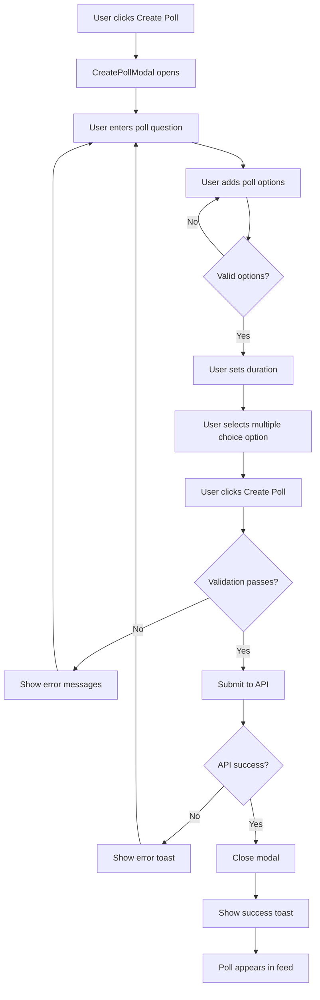
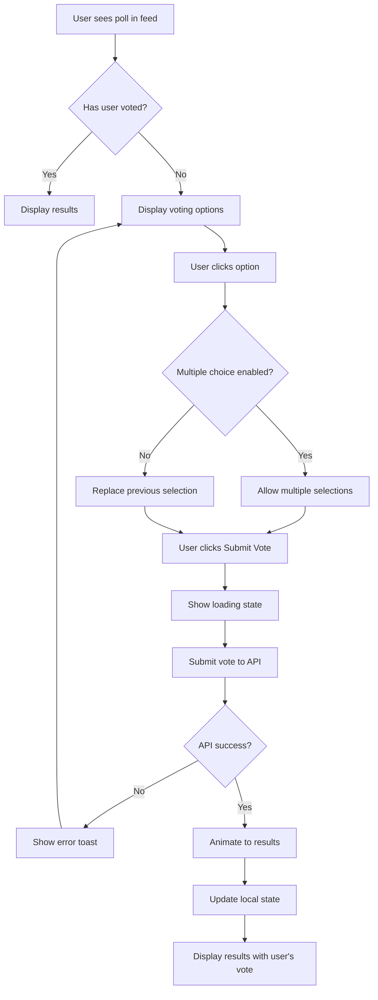
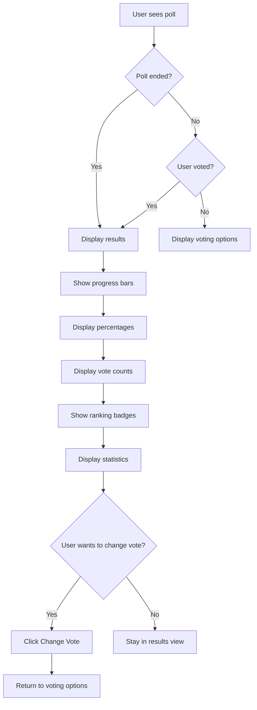
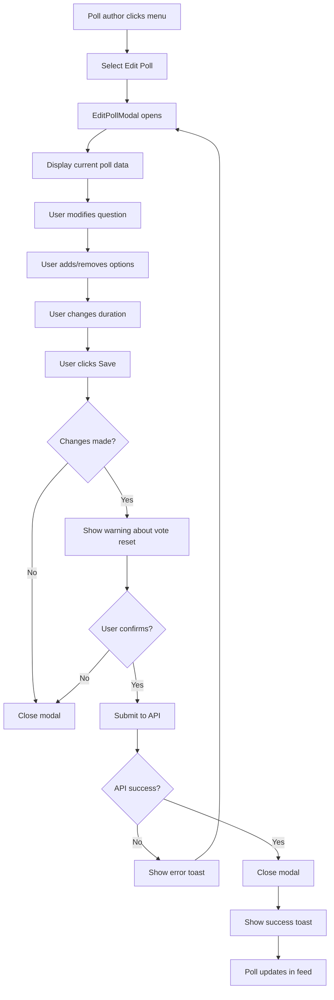
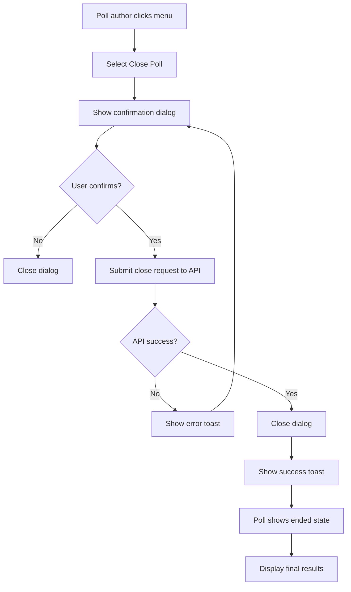
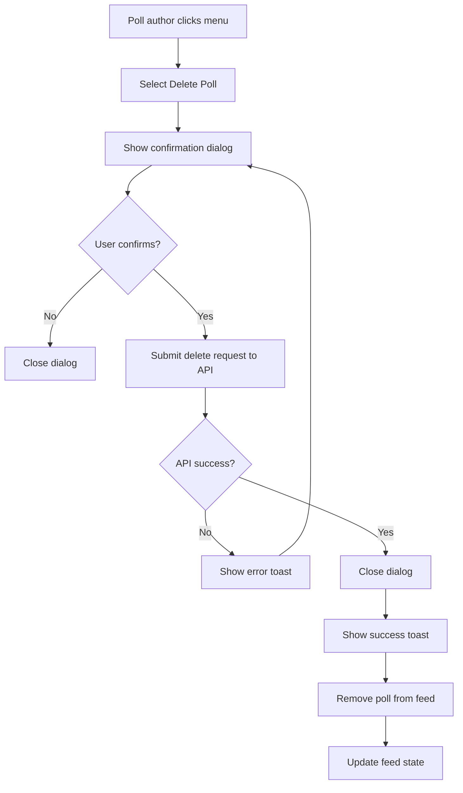

# Poll Feature UI/UX Design Document

## Table of Contents
1. [Overview](#overview)
2. [Design System](#design-system)
3. [Component Specifications](#component-specifications)
4. [User Flows](#user-flows)
5. [Responsive Design](#responsive-design)
6. [Accessibility](#accessibility)

---

## Overview

### Purpose
Design a comprehensive poll feature for the social media platform that integrates seamlessly with the existing Vikinger theme and design patterns.

### Goals
- Provide an intuitive poll creation experience
- Display polls elegantly in the activity feed
- Enable easy voting with visual feedback
- Show results with clear progress indicators
- Offer poll management options for creators

### Scope
This design covers:
1. Poll creation modal
2. Poll display component in activity feed
3. Poll voting interface
4. Poll results display
5. Poll management options (edit, delete, close)

---

## Design System

### Color Palette

| Color Name | Light Mode | Dark Mode | Usage |
|------------|------------|-----------|-------|
| `vikinger-cyan` | `#23d2e2` | `#23d2e2` | Primary poll accent, active states |
| `vikinger-purple` | `#615dfa` | `#615dfa` | Secondary accent, gradients |
| `vikinger-yellow` | `#ffd700` | `#ffd700` | Poll badges, highlights |
| `vikinger-green` | `#00e676` | `#00e676` | Success states, vote confirmation |
| `vikinger-orange` | `#ff9500` | `#ff9500` | Duration indicators, warnings |
| `vikinger-pink` | `#ff6b81` | `#ff6b81` | Delete actions, danger states |
| `vikinger-dark-100` | `#2f3749` | `#2f3749` | Modal backgrounds |
| `vikinger-dark-200` | `#282f3f` | `#282f3f` | Card backgrounds |
| `vikinger-dark-300` | `#232a39` | `#232a39` | Input backgrounds |

### Typography

| Element | Font Family | Size | Weight |
|---------|-------------|------|--------|
| Headings | `Prompt`, sans-serif | 18-24px | 600-700 |
| Body Text | `Prompt`, sans-serif | 14-16px | 400-500 |
| Labels | `Prompt`, sans-serif | 12-14px | 500 |
| Meta Text | `Prompt`, sans-serif | 11-13px | 400 |

### Spacing

| Token | Value | Usage |
|-------|-------|-------|
| `space-2` | 8px | Small gaps between elements |
| `space-3` | 12px | Default spacing |
| `space-4` | 16px | Section spacing |
| `space-6` | 24px | Major section separation |

### Border Radius

| Token | Value | Usage |
|-------|-------|-------|
| `rounded-lg` | 8px | Small elements, tags |
| `rounded-xl` | 12px | Cards, buttons |
| `rounded-2xl` | 16px | Modals, large cards |

### Shadows

| Token | Value | Usage |
|-------|-------|-------|
| `shadow-vikinger` | `0 4px 20px rgba(97, 93, 250, 0.25)` | Primary cards |
| `shadow-vikinger-lg` | `0 8px 40px rgba(97, 93, 250, 0.35)` | Modals, elevated elements |
| `shadow-card` | `0 4px 16px rgba(0, 0, 0, 0.1)` | Standard cards |

### Gradients

| Name | Value | Usage |
|------|-------|-------|
| `gradient-vikinger` | `linear-gradient(90deg, #615dfa 0%, #23d2e2 100%)` | Primary buttons, active states |
| `gradient-pink` | `linear-gradient(90deg, #ff6b81 0%, #615dfa 100%)` | Special highlights |
| `gradient-green` | `linear-gradient(90deg, #00e676 0%, #23d2e2 100%)` | Success states |

---

## Component Specifications

### 1. Poll Creation Modal (`CreatePollModal.vue`)

#### Purpose
A modal for creating new polls with questions, options, and settings.

#### Layout Structure

```
┌─────────────────────────────────────────────────────┐
│  [×] สร้างโพล                                      │
├─────────────────────────────────────────────────────┤
│  ┌─────┐  ชื่อผู้ใช้                                │
│  │Avatar│  [▼ สาธารณะ]                              │
│  └─────┘                                           │
├─────────────────────────────────────────────────────┤
│                                                     │
│  ┌───────────────────────────────────────────────┐ │
│  │ คำถามโพล...                                   │ │
│  └───────────────────────────────────────────────┘ │
│                                                     │
│  ┌───────────────────────────────────────────────┐ │
│  │ ┌──┐ 1. [ตัวเลือกที่ 1.....................] │ │
│  │ │✓│  [×]                                        │ │
│  │ └──┘                                           │ │
│  │ ┌──┐ 2. [ตัวเลือกที่ 2.....................] │ │
│  │ │✓│  [×]                                        │ │
│  │ └──┘                                           │ │
│  │ ┌──┐ 3. [ตัวเลือกที่ 3.....................] │ │
│  │ │✓│  [×]                                        │ │
│  │ └──┘                                           │ │
│  │ [+ เพิ่มตัวเลือก] (สูงสุด 6 ตัวเลือก)        │ │
│  └───────────────────────────────────────────────┘ │
│                                                     │
│  ┌───────────────────────────────────────────────┐ │
│  │ ⏱ ระยะเวลาโพล: [24 ชั่วโมง ▼]                │ │
│  │    • 1 ชั่วโมง                                  │ │
│  │    • 6 ชั่วโมง                                  │ │
│  │    • 24 ชั่วโมง                                 │ │
│  │    • 3 วัน                                      │ │
│  │    • 7 วัน                                      │ │
│  │    • 30 วัน                                     │ │
│  └───────────────────────────────────────────────┘ │
│                                                     │
│  ┌───────────────────────────────────────────────┐ │
│  │ ✓ อนุญาตให้ผู้ใช้เลือกหลายคำตอบ              │ │
│  └───────────────────────────────────────────────┘ │
│                                                     │
│  [สร้างโพล]                                       │
│                                                     │
└─────────────────────────────────────────────────────┘
```

#### Component Props

```typescript
interface CreatePollModalProps {
  show: boolean
}
```

#### Component Emits

```typescript
interface CreatePollModalEmits {
  close: () => void
  pollCreated: (poll: Poll) => void
}
```

#### State Management

```typescript
// Form State
const pollQuestion = ref('')
const pollOptions = ref(['', ''])
const allowMultiple = ref(false)
const pollDuration = ref(24) // hours
const isSubmitting = ref(false)

// UI State
const showDurationDropdown = ref(false)
const validationErrors = ref<Record<string, string>>({})
```

#### Validation Rules

| Field | Rule | Error Message |
|-------|------|---------------|
| Question | Required, min 5 chars | 'กรุณาใส่คำถามอย่างน้อย 5 ตัวอักษร' |
| Options | Required, min 2, max 6 | 'กรุณาใส่ตัวเลือกอย่างน้อย 2 ข้อ (สูงสุด 6 ข้อ)' |
| Option Text | Min 1 char | 'กรุณาใส่ข้อความในแต่ละตัวเลือก' |
| Duration | Required, min 1 hour | 'กรุณาระบุระยะเวลาโพล' |

#### CSS Classes

```css
/* Modal Container */
.poll-modal {
  @apply fixed inset-0 z-50 flex items-start justify-center pt-10 md:pt-16 overflow-y-auto;
}

/* Modal Backdrop */
.poll-modal-backdrop {
  @apply fixed inset-0 bg-black/50 backdrop-blur-sm;
}

/* Modal Content */
.poll-modal-content {
  @apply w-full max-w-2xl mx-4 mb-10 bg-white dark:bg-vikinger-dark-100 rounded-xl shadow-vikinger-lg;
}

/* Input Styling */
.poll-input {
  @apply w-full px-4 py-3 rounded-xl border border-gray-200 dark:border-vikinger-dark-50/30 
         bg-white dark:bg-vikinger-dark-200 text-gray-800 dark:text-white
         placeholder-gray-400 focus:outline-none focus:ring-2 focus:ring-vikinger-purple/50 
         focus:border-vikinger-purple transition-all;
}

/* Option Item */
.poll-option-item {
  @apply flex items-center gap-3 p-3 rounded-lg border border-gray-200 dark:border-vikinger-dark-50/30
         bg-white dark:bg-vikinger-dark-200 hover:border-vikinger-cyan/50 transition-all;
}

/* Duration Dropdown */
.poll-duration-dropdown {
  @apply absolute top-full left-0 mt-2 w-full bg-white dark:bg-vikinger-dark-100 rounded-xl
         shadow-lg border border-gray-200 dark:border-vikinger-dark-50/30 overflow-hidden z-10;
}

/* Submit Button */
.poll-submit-btn {
  @apply w-full py-3 px-4 bg-gradient-vikinger text-white font-semibold rounded-xl
         hover:shadow-vikinger-lg transition-all duration-300 hover:scale-[1.02]
         disabled:opacity-50 disabled:cursor-not-allowed disabled:hover:scale-100;
}
```

#### Animations

```css
/* Modal Entry Animation */
@keyframes poll-modal-in {
  0% {
    opacity: 0;
    transform: scale(0.9) translateY(-20px);
  }
  100% {
    opacity: 1;
    transform: scale(1) translateY(0);
  }
}

/* Option Add Animation */
@keyframes option-slide-in {
  0% {
    opacity: 0;
    transform: translateX(-20px);
  }
  100% {
    opacity: 1;
    transform: translateX(0);
  }
}

/* Duration Dropdown Animation */
@keyframes dropdown-fade-in {
  0% {
    opacity: 0;
    transform: translateY(-10px);
  }
  100% {
    opacity: 1;
    transform: translateY(0);
  }
}
```

---

### 2. Poll Display Component (`PollCard.vue`)

#### Purpose
A component for displaying polls in the activity feed with voting interface and results.

#### Layout Structure

```
┌─────────────────────────────────────────────────────┐
│  ┌─────┐  ชื่อผู้ใช้  •  โพล  •  2 ชั่วโมงที่แล้ว    │
│  │Avatar│  ⏱ เหลือ 22 ชั่วโมง                     │
│  └─────┘                                           │
├─────────────────────────────────────────────────────┤
│                                                     │
│  📊 คำถามโพลที่น่าสนใจ?                          │
│                                                     │
│  ┌───────────────────────────────────────────────┐ │
│  │ ┌─┐ 45% ████████████░░░░░░░░ 45 คน            │ │
│  │ │✓│ ตัวเลือกที่ 1                             │ │
│  │ └─┘                                           │ │
│  └───────────────────────────────────────────────┘ │
│                                                     │
│  ┌───────────────────────────────────────────────┐ │
│  │ ┌─┐ 30% ████████░░░░░░░░░░░░ 30 คน            │ │
│  │ │✓│ ตัวเลือกที่ 2                             │ │
│  │ └─┘                                           │ │
│  └───────────────────────────────────────────────┘ │
│                                                     │
│  ┌───────────────────────────────────────────────┐ │
│  │   25% ██████░░░░░░░░░░░░░░ 25 คน              │ │
│  │   ตัวเลือกที่ 3                               │ │
│  └───────────────────────────────────────────────┘ │
│                                                     │
│  💬 100 คนโหวต  •  ⏱ สิ้นสุด 22 ชั่วโมง        │
│                                                     │
├─────────────────────────────────────────────────────┤
│  [👍 ถูกใจ]  [💬 ความคิดเห็น]  [🔗 แชร์]         │
└─────────────────────────────────────────────────────┘
```

#### Component Props

```typescript
interface PollCardProps {
  poll: Poll
  showActions?: boolean
  isNested?: boolean
}

interface Poll {
  id: number
  question: string
  options: PollOption[]
  total_votes: number
  is_multiple: boolean
  is_ended: boolean
  ends_at: string
  created_at: string
  user_voted: boolean
  user_votes?: number[]
  author: User
}
```

#### Component Emits

```typescript
interface PollCardEmits {
  vote: (optionIds: number[]) => void
  delete: () => void
  edit: () => void
  close: () => void
}
```

#### State Management

```typescript
// Local State
const isVoting = ref(false)
const selectedOptions = ref<number[]>([])
const showResults = ref(false)
const localVotes = ref(props.poll.user_votes || [])
const localTotalVotes = ref(props.poll.total_votes)
```

#### CSS Classes

```css
/* Poll Card Container */
.poll-card {
  @apply vikinger-card bg-white dark:bg-vikinger-dark-100 rounded-xl overflow-hidden;
}

/* Poll Header */
.poll-header {
  @apply flex items-center gap-3 mb-4;
}

/* Poll Question */
.poll-question {
  @apply text-lg font-semibold text-gray-800 dark:text-white mb-4;
}

/* Option Container (Voting Mode) */
.poll-option-voting {
  @apply flex items-center gap-3 p-4 rounded-xl border-2 border-gray-200 dark:border-vikinger-dark-50/30
         bg-white dark:bg-vikinger-dark-200 cursor-pointer hover:border-vikinger-cyan
         hover:bg-vikinger-cyan/5 transition-all duration-200;
}

.poll-option-voting.selected {
  @apply border-vikinger-cyan bg-vikinger-cyan/10;
}

/* Option Container (Results Mode) */
.poll-option-results {
  @apply relative p-4 rounded-xl border-2 border-transparent transition-all duration-300;
}

.poll-option-results.voted {
  @apply border-vikinger-cyan bg-vikinger-cyan/5;
}

/* Progress Bar */
.poll-progress-bar {
  @apply absolute inset-0 rounded-xl bg-gradient-vikinger opacity-10;
}

.poll-option-results.voted .poll-progress-bar {
  @apply opacity-20;
}

/* Progress Bar Fill */
.poll-progress-fill {
  @apply h-full rounded-xl bg-gradient-vikinger transition-all duration-500;
}

/* Option Text */
.poll-option-text {
  @apply relative z-10 font-medium text-gray-800 dark:text-white;
}

/* Option Percentage */
.poll-option-percentage {
  @apply relative z-10 text-sm font-bold text-vikinger-cyan;
}

/* Option Vote Count */
.poll-option-votes {
  @apply relative z-10 text-xs text-gray-500 dark:text-gray-400;
}

/* Poll Footer */
.poll-footer {
  @apply flex items-center gap-4 text-sm text-gray-500 dark:text-gray-400 mt-4 pt-4
         border-t border-gray-200 dark:border-vikinger-dark-50/30;
}

/* Action Buttons */
.poll-action-btn {
  @apply flex items-center gap-2 px-4 py-2 rounded-lg transition-all duration-200;
}

.poll-action-btn.primary {
  @apply bg-gradient-vikinger text-white hover:shadow-vikinger;
}

.poll-action-btn.secondary {
  @apply bg-gray-100 dark:bg-vikinger-dark-200 text-gray-700 dark:text-gray-300
         hover:bg-gray-200 dark:hover:bg-vikinger-dark-300;
}
```

#### Animations

```css
/* Vote Selection Animation */
@keyframes vote-select {
  0% {
    transform: scale(1);
  }
  50% {
    transform: scale(1.02);
  }
  100% {
    transform: scale(1);
  }
}

/* Progress Bar Animation */
@keyframes progress-fill {
  0% {
    width: 0%;
  }
  100% {
    width: var(--progress-width);
  }
}

/* Result Reveal Animation */
@keyframes result-reveal {
  0% {
    opacity: 0;
    transform: translateY(10px);
  }
  100% {
    opacity: 1;
    transform: translateY(0);
  }
}
```

---

### 3. Poll Voting Interface

#### Purpose
An interactive interface for users to vote on polls with visual feedback.

#### States

##### State 1: Before Voting (Selection Mode)

```
┌─────────────────────────────────────────────┐
│  📊 คำถามโพล?                              │
│                                             │
│  ┌─────────────────────────────────────┐   │
│  │ ⬜ ตัวเลือกที่ 1                     │   │
│  └─────────────────────────────────────┘   │
│                                             │
│  ┌─────────────────────────────────────┐   │
│  │ ⬜ ตัวเลือกที่ 2                     │   │
│  └─────────────────────────────────────┘   │
│                                             │
│  ┌─────────────────────────────────────┐   │
│  │ ⬜ ตัวเลือกที่ 3                     │   │
│  └─────────────────────────────────────┘   │
│                                             │
│  [ส่งโหวต]                                 │
└─────────────────────────────────────────────┘
```

##### State 2: After Selection (Submit Ready)

```
┌─────────────────────────────────────────────┐
│  📊 คำถามโพล?                              │
│                                             │
│  ┌─────────────────────────────────────┐   │
│  │ ✅ ตัวเลือกที่ 1 ✓                   │   │
│  └─────────────────────────────────────┘   │
│                                             │
│  ┌─────────────────────────────────────┐   │
│  │ ⬜ ตัวเลือกที่ 2                     │   │
│  └─────────────────────────────────────┘   │
│                                             │
│  ┌─────────────────────────────────────┐   │
│  │ ✅ ตัวเลือกที่ 3 ✓                   │   │
│  └─────────────────────────────────────┘   │
│                                             │
│  [ส่งโหวต] ✓                               │
└─────────────────────────────────────────────┘
```

##### State 3: After Voting (Results Mode)

```
┌─────────────────────────────────────────────┐
│  📊 คำถามโพล?                              │
│                                             │
│  ┌─────────────────────────────────────┐   │
│  │ ████████████░░░░ 50% ✓ ตัวเลือกที่ 1 │   │
│  │ 50 คน                                 │   │
│  └─────────────────────────────────────┘   │
│                                             │
│  ┌─────────────────────────────────────┐   │
│  │ ██████░░░░░░░░░░ 30%   ตัวเลือกที่ 2 │   │
│  │ 30 คน                                 │   │
│  └─────────────────────────────────────┘   │
│                                             │
│  ┌─────────────────────────────────────┐   │
│  │ ████░░░░░░░░░░░░ 20% ✓ ตัวเลือกที่ 3 │   │
│  │ 20 คน                                 │   │
│  └─────────────────────────────────────┘   │
│                                             │
│  💬 100 คนโหวต  •  คุณโหวตแล้ว ✓        │
└─────────────────────────────────────────────┘
```

#### Interaction Patterns

| Action | Behavior | Visual Feedback |
|--------|----------|-----------------|
| Click Option | Select/deselect option | Border turns cyan, checkbox fills |
| Hover Option | Highlight option | Border brightens, slight scale |
| Submit Vote | Submit selected options | Button shows spinner, results animate in |
| Change Vote | Change selected options | New selection highlights, old fades |
| View Results | Show results without voting | Results display with "change vote" option |

#### Progress Bar Design

```css
/* Progress Bar Container */
.progress-container {
  position: relative;
  height: 48px;
  border-radius: 12px;
  overflow: hidden;
}

/* Background Progress */
.progress-background {
  position: absolute;
  inset: 0;
  background: linear-gradient(90deg, 
    rgba(97, 93, 250, 0.1) 0%, 
    rgba(35, 210, 226, 0.1) 100%);
  border-radius: 12px;
}

/* Fill Progress */
.progress-fill {
  position: absolute;
  inset: 0;
  background: linear-gradient(90deg, #615dfa 0%, #23d2e2 100%);
  border-radius: 12px;
  transition: width 0.5s ease-out;
  animation: progress-fill 0.5s ease-out;
}

/* Voted State */
.progress-fill.voted {
  background: linear-gradient(90deg, 
    rgba(97, 93, 250, 0.3) 0%, 
    rgba(35, 210, 226, 0.3) 100%);
}

/* Leading Option Highlight */
.progress-fill.leading {
  box-shadow: 0 0 20px rgba(35, 210, 226, 0.4);
}
```

---

### 4. Poll Results Display

#### Purpose
Display poll results with clear visual indicators and statistics.

#### Layout Structure

```
┌─────────────────────────────────────────────────────┐
│  📊 ผลการโหวต                                   │
│                                                     │
│  ┌───────────────────────────────────────────────┐ │
│  │ ████████████████████ 60% ✓                    │ │
│  │ ตัวเลือกที่ 1 (คุณโหวต)                      │ │
│  │ 60 คน  •  🏆 อันดับ 1                         │ │
│  └───────────────────────────────────────────────┘ │
│                                                     │
│  ┌───────────────────────────────────────────────┐ │
│  │ ██████████░░░░░░░░ 30%                        │ │
│  │ ตัวเลือกที่ 2                                 │ │
│  │ 30 คน  •  🥈 อันดับ 2                         │ │
│  └───────────────────────────────────────────────┘ │
│                                                     │
│  ┌───────────────────────────────────────────────┐ │
│  │ ████░░░░░░░░░░░░░ 10%                         │ │
│  │ ตัวเลือกที่ 3                                 │ │
│  │ 10 คน  •  🥉 อันดับ 3                         │ │
│  └───────────────────────────────────────────────┘ │
│                                                     │
│  📊 สถิติโพล                                    │
│  ┌─────────────────────────────────────────────┐ │
│  │ 💬 โหวตทั้งหมด: 100 คน                     │ │
│  │ ⏱ เวลาที่เหลือ: 22 ชั่วโมง                │ │
│  │ 📈 อัตราการมีส่วนร่วม: 85%                 │ │
│  └─────────────────────────────────────────────┘ │
│                                                     │
│  [🔄 เปลี่ยนโหวต]  [📤 แชร์ผลโหวต]            │
└─────────────────────────────────────────────────────┘
```

#### Visual Elements

##### Ranking Badges

| Rank | Badge | Color |
|------|-------|-------|
| 1st | 🏆 | Gold (#FFD700) |
| 2nd | 🥈 | Silver (#C0C0C0) |
| 3rd | 🥉 | Bronze (#CD7F32) |

##### Percentage Display

```css
.percentage-display {
  @apply text-2xl font-bold text-transparent bg-clip-text 
         bg-gradient-to-r from-vikinger-purple to-vikinger-cyan;
}

.percentage-small {
  @apply text-sm font-semibold text-vikinger-cyan;
}
```

##### Vote Count Display

```css
.vote-count {
  @apply flex items-center gap-2 text-sm text-gray-500 dark:text-gray-400;
}

.vote-count-icon {
  @apply w-4 h-4 text-vikinger-cyan;
}
```

##### Statistics Card

```css
.stats-card {
  @apply p-4 rounded-xl bg-gray-50 dark:bg-vikinger-dark-200 
         border border-gray-200 dark:border-vikinger-dark-50/30;
}

.stat-item {
  @apply flex items-center justify-between mb-2;
}

.stat-item:last-child {
  @apply mb-0;
}

.stat-label {
  @apply text-sm text-gray-600 dark:text-gray-400;
}

.stat-value {
  @apply text-sm font-semibold text-gray-800 dark:text-white;
}
```

---

### 5. Poll Management Options

#### Purpose
Provide poll creators with options to manage their polls.

#### Menu Structure

```
┌─────────────────────────────┐
│  ⋮ เมนูโพล                │
├─────────────────────────────┤
│  ✏️ แก้ไขโพล               │
│  ⏸️ ปิดโหวต               │
│  📊 ดูผลลัพธ์              │
│  📤 แชร์โพล                │
├─────────────────────────────┤
│  🗑️ ลบโพล                 │
└─────────────────────────────┘
```

#### Edit Poll Modal

```
┌─────────────────────────────────────────────────────┐
│  [×] แก้ไขโพล                                      │
├─────────────────────────────────────────────────────┤
│                                                     │
│  ┌───────────────────────────────────────────────┐ │
│  │ คำถามโพล...                                   │ │
│  └───────────────────────────────────────────────┘ │
│                                                     │
│  ┌───────────────────────────────────────────────┐ │
│  │ ┌──┐ 1. [ตัวเลือกที่ 1.....................] │ │
│  │ │✓│  [×]  45 คน (45%)                        │ │
│  │ └──┘                                           │ │
│  │ ┌──┐ 2. [ตัวเลือกที่ 2.....................] │ │
│  │ │✓│  [×]  30 คน (30%)                        │ │
│  │ └──┘                                           │ │
│  │ ┌──┐ 3. [ตัวเลือกที่ 3.....................] │ │
│  │ │✓│  [×]  25 คน (25%)                        │ │
│  │ └──┘                                           │ │
│  │ [+ เพิ่มตัวเลือก]                            │ │
│  └───────────────────────────────────────────────┘ │
│                                                     │
│  ⚠️ การแก้ไขจะรีเซ็ตโหวตทั้งหมด               │
│                                                     │
│  [บันทึกการแก้ไข]  [ยกเลิก]                     │
│                                                     │
└─────────────────────────────────────────────────────┘
```

#### Close Poll Confirmation

```
┌─────────────────────────────────────────────────────┐
│  ⏸️ ปิดโหวต                                        │
├─────────────────────────────────────────────────────┤
│                                                     │
│  คุณต้องการปิดโหวตนี้ใช่หรือไม่?                 │
│                                                     │
│  เมื่อปิดโหวตแล้ว:                                │
│  • ผู้ใช้จะไม่สามารถโหวตได้อีก                 │
│  • ผลลัพธ์จะแสดงทันที                            │
│  • ไม่สามารถเปิดโหวตใหม่ได้                    │
│                                                     │
│  [ยืนยันการปิดโหวต]  [ยกเลิก]                   │
│                                                     │
└─────────────────────────────────────────────────────┘
```

#### Delete Poll Confirmation

```
┌─────────────────────────────────────────────────────┐
│  🗑️ ลบโพล                                         │
├─────────────────────────────────────────────────────┤
│                                                     │
│  คุณต้องการลบโพลนี้ใช่หรือไม่?                  │
│                                                     │
│  ⚠️ การดำเนินการนี้ไม่สามารถย้อนกลับได้       │
│                                                     │
│  เมื่อลบโพลแล้ว:                                  │
│  • โหวตทั้งหมดจะหายไป                           │
│  • ความคิดเห็นทั้งหมดจะหายไป                    │
│  • ข้อมูลทั้งหมดจะถูกลบถาวร                    │
│                                                     │
│  [ยืนยันการลบ]  [ยกเลิก]                         │
│                                                     │
└─────────────────────────────────────────────────────┘
```

#### CSS Classes

```css
/* Menu Container */
.poll-menu {
  @apply absolute right-0 top-full mt-2 w-48 bg-white dark:bg-vikinger-dark-100
         rounded-xl shadow-lg border border-gray-200 dark:border-vikinger-dark-50/30
         overflow-hidden z-50;
}

/* Menu Item */
.poll-menu-item {
  @apply w-full flex items-center gap-3 px-4 py-3 hover:bg-gray-50 dark:hover:bg-vikinger-dark-200
         transition-colors text-left text-sm font-medium text-gray-700 dark:text-gray-300;
}

.poll-menu-item.danger {
  @apply hover:bg-red-50 dark:hover:bg-red-900/20 text-red-500;
}

/* Warning Banner */
.poll-warning-banner {
  @apply p-4 rounded-xl bg-yellow-50 dark:bg-yellow-900/20 border border-yellow-200 dark:border-yellow-700/30;
}

.poll-warning-text {
  @apply text-sm text-yellow-700 dark:text-yellow-300;
}
```

---

## User Flows

### Flow 1: Create a Poll



### Flow 2: Vote on a Poll



### Flow 3: View Poll Results



### Flow 4: Edit a Poll



### Flow 5: Close a Poll



### Flow 6: Delete a Poll



---

## Responsive Design

### Breakpoints

| Breakpoint | Width | Target Devices |
|------------|-------|----------------|
| `xs` | 0px | Small phones |
| `sm` | 640px | Large phones |
| `md` | 768px | Tablets |
| `lg` | 1024px | Small laptops |
| `xl` | 1280px | Desktops |
| `2xl` | 1536px | Large screens |

### Mobile Layout (< 640px)

#### Poll Creation Modal
- Full-screen modal
- Reduced padding (12px)
- Single column layout
- Touch-friendly tap targets (44px min)
- Bottom sheet style for options

#### Poll Card
- Compact header
- Stacked action buttons
- Full-width progress bars
- Simplified statistics

### Tablet Layout (640px - 1024px)

#### Poll Creation Modal
- Centered modal with max-width
- Two-column option layout
- Standard padding (16px)

#### Poll Card
- Standard layout
- Inline action buttons
- Full statistics display

### Desktop Layout (> 1024px)

#### Poll Creation Modal
- Fixed width (max-w-2xl)
- Optimal spacing (24px)
- Hover interactions enabled

#### Poll Card
- Full feature set
- All animations enabled
- Rich statistics display

---

## Accessibility

### Keyboard Navigation

| Key | Action |
|-----|--------|
| `Tab` | Navigate between focusable elements |
| `Shift + Tab` | Navigate backwards |
| `Enter` | Submit form, activate button |
| `Escape` | Close modal, cancel action |
| `Space` | Toggle checkbox, select option |
| `Arrow Keys` | Navigate option list |

### ARIA Labels

```html
<!-- Poll Option (Voting Mode) -->
<button 
  role="radio"
  aria-checked="false"
  aria-label="Vote for option 1: Option text"
  class="poll-option-voting"
>
  <!-- Option content -->
</button>

<!-- Poll Option (Results Mode) -->
<div 
  role="progressbar"
  aria-valuenow="45"
  aria-valuemin="0"
  aria-valuemax="100"
  aria-label="Option 1: 45% of votes"
  class="poll-option-results"
>
  <!-- Option content -->
</div>

<!-- Poll Creation Modal -->
<div 
  role="dialog"
  aria-modal="true"
  aria-labelledby="poll-modal-title"
  class="poll-modal"
>
  <h2 id="poll-modal-title">สร้างโพล</h2>
  <!-- Modal content -->
</div>
```

### Focus Management

```typescript
// Focus trap in modal
const trapFocus = (event: KeyboardEvent) => {
  if (event.key !== 'Tab') return
  
  const focusableElements = modalRef.value?.querySelectorAll(
    'button, [href], input, select, textarea, [tabindex]:not([tabindex="-1"])'
  )
  
  const firstElement = focusableElements?.[0] as HTMLElement
  const lastElement = focusableElements?.[focusableElements.length - 1] as HTMLElement
  
  if (event.shiftKey) {
    if (document.activeElement === firstElement) {
      event.preventDefault()
      lastElement?.focus()
    }
  } else {
    if (document.activeElement === lastElement) {
      event.preventDefault()
      firstElement?.focus()
    }
  }
}

// Focus on open
onMounted(() => {
  if (props.show) {
    firstInputRef.value?.focus()
  }
})
```

### Screen Reader Support

```html
<!-- Live region for vote updates -->
<div 
  role="status" 
  aria-live="polite"
  aria-atomic="true"
  class="sr-only"
>
  {{ voteUpdateMessage }}
</div>

<!-- Progress bar with accessible label -->
<div 
  role="progressbar"
  aria-valuenow="45"
  aria-valuemin="0"
  aria-valuemax="100"
  aria-label="Option 1: 45% of votes, 45 people voted"
  class="poll-progress-bar"
>
  <div class="poll-progress-fill" style="width: 45%"></div>
</div>
```

### Color Contrast

All text and interactive elements meet WCAG AA standards:
- Normal text: 4.5:1 contrast ratio
- Large text (18px+): 3:1 contrast ratio
- UI components: 3:1 contrast ratio

### Reduced Motion

```css
@media (prefers-reduced-motion: reduce) {
  * {
    animation-duration: 0.01ms !important;
    animation-iteration-count: 1 !important;
    transition-duration: 0.01ms !important;
  }
}
```

---

## Implementation Notes

### Component Structure

```
components/
├── play/
│   └── poll/
│       ├── CreatePollModal.vue
│       ├── EditPollModal.vue
│       ├── PollCard.vue
│       ├── PollOption.vue
│       ├── PollResults.vue
│       ├── PollProgressBar.vue
│       └── PollMenu.vue
```

### API Endpoints

| Endpoint | Method | Description |
|----------|--------|-------------|
| `/api/polls` | POST | Create new poll |
| `/api/polls/:id` | GET | Get poll details |
| `/api/polls/:id` | PUT | Update poll |
| `/api/polls/:id` | DELETE | Delete poll |
| `/api/polls/:id/vote` | POST | Submit vote |
| `/api/polls/:id/close` | POST | Close poll |
| `/api/polls/:id/results` | GET | Get poll results |

### State Management

```typescript
// stores/poll.ts
export const usePollStore = defineStore('poll', () => {
  const polls = ref<Poll[]>([])
  const currentPoll = ref<Poll | null>(null)
  
  const addPoll = (poll: Poll) => {
    polls.value.unshift(poll)
  }
  
  const updatePoll = (id: number, updates: Partial<Poll>) => {
    const index = polls.value.findIndex(p => p.id === id)
    if (index !== -1) {
      polls.value[index] = { ...polls.value[index], ...updates }
    }
  }
  
  const removePoll = (id: number) => {
    polls.value = polls.value.filter(p => p.id !== id)
  }
  
  return {
    polls,
    currentPoll,
    addPoll,
    updatePoll,
    removePoll
  }
})
```

---

## Appendix

### Icon References

| Icon | Iconify Name | Usage |
|------|--------------|-------|
| Poll | `fluent:poll-24-regular` | Poll badge, menu |
| Check | `fluent:checkmark-24-regular` | Selected state |
| Close | `fluent:dismiss-24-regular` | Close modal |
| Edit | `fluent:edit-24-regular` | Edit poll |
| Delete | `fluent:delete-24-regular` | Delete poll |
| Clock | `fluent:clock-24-regular` | Duration |
| Trophy | `fluent:trophy-24-regular` | Ranking |
| Share | `fluent:share-24-regular` | Share poll |

### Color Variables

```css
:root {
  --poll-primary: #615dfa;
  --poll-secondary: #23d2e2;
  --poll-accent: #ffd700;
  --poll-success: #00e676;
  --poll-warning: #ff9500;
  --poll-danger: #ff6b81;
}

.dark {
  --poll-primary: #615dfa;
  --poll-secondary: #23d2e2;
  --poll-accent: #ffd700;
  --poll-success: #00e676;
  --poll-warning: #ff9500;
  --poll-danger: #ff6b81;
}
```

### Animation Timings

| Animation | Duration | Easing |
|-----------|----------|--------|
| Modal Entry | 300ms | cubic-bezier(0.34, 1.56, 0.64, 1) |
| Modal Exit | 200ms | ease-in |
| Progress Bar | 500ms | ease-out |
| Option Select | 200ms | ease-out |
| Dropdown | 200ms | ease-out |

---

## Conclusion

This design document provides a comprehensive UI/UX specification for the poll feature that:

1. **Integrates seamlessly** with the existing Vikinger theme and design patterns
2. **Provides intuitive** poll creation and voting experiences
3. **Delivers clear** visual feedback through progress bars and animations
4. **Supports accessibility** with keyboard navigation and screen reader support
5. **Adapts responsively** across mobile, tablet, and desktop devices
6. **Offers comprehensive** poll management options for creators

The design follows established patterns from the existing codebase while introducing poll-specific elements that enhance the user experience.
